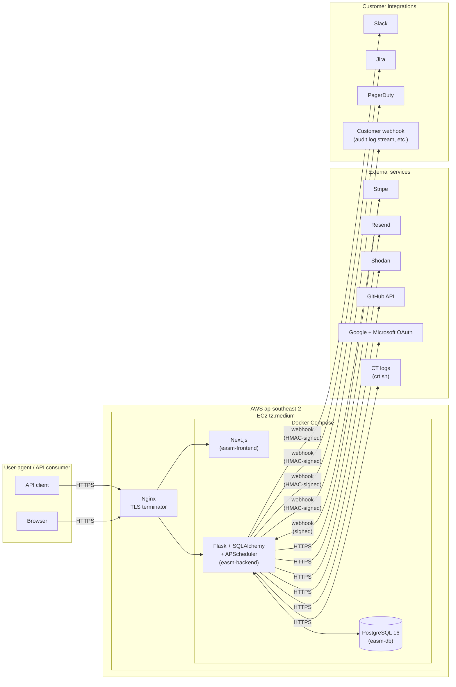

# Nano EASM — Software Architecture Document

## Document Control

| Field | Value |
|---|---|
| Document ID | SDLC-03 |
| Title | Nano EASM — Software Architecture Document (SAD) |
| Version | 0.1 (Draft) |
| Status | Draft — pending sign-off |
| Owner | [TBD — founder name] |
| Author | [TBD — founder name] |
| Created | 2026-05-05 |
| Last reviewed | 2026-05-05 |
| Next review | +90 days |
| Related documents | 01 Vision & Charter, 02 SRS, 04 Threat Model, 05 Security Policy, 06 Test Strategy, 08 Backup & DR Plan; ADRs in `docs/adr/` |

---

## 1. Introduction

### 1.1 Purpose

This Software Architecture Document (SAD) describes the **structure** of Nano EASM — components, runtime processes, data, deployment, security boundaries, observability, and the rationale behind the major technology choices. It is the technical reference that tells an engineer (or auditor) how the system is wired up.

The SAD is **prescriptive** — it states what the architecture *shall be*, with `[GAP]` markers where the current implementation lags the spec.

### 1.2 Scope

The SAD covers everything that runs in production: the public marketing site, the authenticated web application, the public Quick Scan, the backend API, the background scheduler, the database, the reverse proxy, every external service the system integrates with, and the operational pipeline that gets code from commit to running container.

It does **not** cover:

- **Functional behaviour** — the SRS (`docs/sdlc/02-srs.md` + `02-srs/*`) is authoritative for what the system does.
- **Threat analysis** — the Threat Model (doc 04) covers attacker scenarios, abuse paths, and mitigations. The SAD covers structural security (encryption boundaries, secrets handling, RBAC enforcement points).
- **Test strategy** — the Test Strategy (doc 06) defines coverage and process.
- **Operational recovery** — the Backup & DR Plan (doc 08) defines RTO/RPO procedures end-to-end. The SAD has only a brief description of the structural backup topology.

### 1.3 Audience

The SAD is written for engineers — current and future. Specifically:

- **The founder/author** (single source of truth for "how does this fit together?")
- **Future engineering hires** (onboarding reference)
- **Security auditors / customer architecture reviewers** (under NDA)
- **Anyone evaluating a third-party contribution or vendor swap-out**

It is **not** marketing copy. It can be technical without apologising; jargon is fine where defined in the glossary (`01-vision-and-charter.md` §16).

### 1.4 Document conventions

- **Diagrams** — all diagrams in this SAD use [Mermaid](https://mermaid.js.org). Mermaid is rendered inline by GitHub, GitLab, most IDEs, and modern static-site generators.
- **Status markers** — match the SRS convention: `[IMPLEMENTED]`, `[PARTIAL]`, `[GAP: not implemented]`, `[BEYOND SPEC]`.
- **Cross-references** — to SRS requirements use the FR / NFR ID (e.g., "see `FR-AUTH-006`"). To ADRs use the ADR number (e.g., "see ADR-0005").
- **"Shall" and "should"** — same convention as the SRS. "Shall" = prescriptive, "should" = recommendation.

### 1.5 References

| Ref | Document |
|---|---|
| R-01 | `docs/sdlc/01-vision-and-charter.md` — Vision & Charter |
| R-02 | `docs/sdlc/02-srs.md` + `02-srs/*` — Software Requirements Specification |
| R-03 | `docs/sdlc/04-threat-model.md` — Threat Model (forthcoming) |
| R-04 | `docs/sdlc/05-security-policy.md` — Security Policy (forthcoming) |
| R-05 | `docs/sdlc/08-backup-dr.md` — Backup & DR Plan (forthcoming) |
| R-06 | `docs/adr/*` — Architectural Decision Records |
| R-07 | Kruchten, *The 4+1 View Model of Architecture*, IEEE Software 1995 |
| R-08 | Bass, Clements, Kazman, *Software Architecture in Practice*, 4th ed. |

---

## 2. Architectural Goals & Constraints

### 2.1 Architectural goals

In priority order:

1. **Tenant isolation correctness** — cross-tenant data leakage is the worst possible failure mode of a multi-tenant security platform. The architecture biases toward simple, mechanically-enforced isolation rather than clever sharing.
2. **Operability for one engineer** — the architecture must be runnable, debuggable, and recoverable by a solo founder. No more moving parts than necessary.
3. **Honesty over polish** — the architecture should make it easy to tell the truth about what the system does and does not do (compliance posture, finding accuracy, etc.). It should be structurally hard to "secretly drift" from charter §12 honesty stance.
4. **Cost discipline** — the system serves community-preview-tier customers from a single A$50/mo EC2 instance. Architecture must hold that economics until revenue justifies otherwise.
5. **Path to scale exists, but not built** — the design has obvious extension points (split DB, dedicated worker pool, multi-region) without requiring those today.
6. **External-service replaceability** — Stripe, Resend, Shodan are integrated through service classes, not scattered direct calls, so a vendor swap is a contained change.

### 2.2 Architectural constraints

Non-negotiable from the charter:

| ID | Constraint | Source |
|---|---|---|
| CON-01 | Hosted SaaS only — no self-hosted / customer-VPC deployment | Charter §5.2 |
| CON-02 | Single AWS region (`ap-southeast-2`) for all tenant data | Charter §10.1, NFR-COMP-005 |
| CON-03 | PostgreSQL as the sole data store | Charter §10.1 |
| CON-04 | Solo-founder operability — no Kafka, Kubernetes, microservices fleet | Charter §10.3 |
| CON-05 | AUD-only billing — no multi-currency complexity | Charter §10.1 |
| CON-06 | Browser-only frontend — no native apps, no plugins | Charter §10.1 |
| CON-07 | No SSO with enterprise IdPs (Okta, Azure AD via SAML/OIDC) — Google + Microsoft consumer OAuth only | Charter §10.1 |
| CON-08 | All audit, billing, and data-residency obligations apply within Australia | Charter §10.2 |

These constraints **shape every architectural choice** in this document. Many otherwise reasonable patterns (e.g., a dedicated event-streaming layer, multi-region active-active, sharded databases) are excluded by them.

### 2.3 Quality attributes (NFR mapping)

The SRS lists ~50 non-functional requirements. The SAD shows how the architecture satisfies the **categories** of those NFRs. Specific mappings live in the relevant view files in `03-sad/`.

| Quality | Architectural mechanism | Component view |
|---|---|---|
| **Performance** | Async background jobs for heavy work; in-process scheduler; bounded concurrency in scan orchestrator | Runtime |
| **Security** | TLS termination at nginx; JWT-Bearer (no cookie CSRF surface); per-route RBAC decorators; tenant-scoped queries; HMAC on outbound webhooks; signature verification on inbound Stripe | Security |
| **Reliability** | Daemon-thread fire-and-forget pattern for non-critical work; structured try/except boundaries; idempotent Stripe webhooks; retention-aware data lifecycle | Runtime, Data |
| **Maintainability** | Flask blueprint per module; SQLAlchemy ORM with migration discipline; one-file-per-feature in frontend route groups; minimal abstractions | Development |
| **Observability** | Structured app logs; audit log table; per-attempt webhook delivery log; admin health page | Observability |
| **Tenant isolation** | `g.current_organization_id` populated at auth; every business query filters on it; default-deny route decorators | Logical, Security |
| **Cost** | Single EC2; in-process scheduler; PostgreSQL all-data; no separate cache / queue / search engine | Deployment |

---

## 3. Stakeholders and Concerns

| Stakeholder | Architectural concerns |
|---|---|
| **Founder (operator)** | Can I debug a production issue in <30 min? Can I deploy without ceremony? Does my AWS bill stay under A$200/mo? |
| **Future engineer (co-founder / hire)** | How long to get productive? Can I trace any feature from URL → route → service → DB? Are conventions consistent? |
| **Customer (Owner / Admin)** | Is my org's data isolated? How does authentication work? Where are my secrets stored? |
| **Customer-side architecture reviewer (under NDA)** | Tenant isolation guarantees, encryption topology, dependencies on US-resident services, audit log integrity |
| **Security auditor** | Does the system match what's claimed in the SRS / Security Policy? Are RBAC checks enforced or bypass-able? |
| **Payment processor (Stripe)** | Webhook idempotency, signature verification, PCI scope (we're SAQ-A — no card data on our infra) |
| **Operational dependencies (Resend / Shodan / Stripe)** | The system handles their outages gracefully? |

The architecture views in §4 each address a subset of these concerns explicitly.

---

## 4. Architecture Views

This SAD uses Kruchten's 4+1 View Model (R-07) — five views, each emphasising a different stakeholder concern, with shared scenarios stitching them together.

| View | File | Stakeholder focus |
|---|---|---|
| **Logical** | `03-sad/01-logical-view.md` | Engineers — module decomposition, layers, dependencies |
| **Runtime** | `03-sad/02-runtime-view.md` | Engineers + ops — processes, threads, schedulers, concurrency |
| **Development** | `03-sad/03-development-view.md` | Engineers + future hires — code organisation, dev workflow, CI/CD |
| **Deployment** | `03-sad/04-deployment-view.md` | Ops + security — cloud topology, container model, scaling path |
| **Scenarios** | `03-sad/09-key-scenarios.md` | Everyone — sequence diagrams stitching the other views |

Plus four dedicated views for cross-cutting concerns that span all four primary views:

| View | File | Why it's separate |
|---|---|---|
| **Data** | `03-sad/05-data-architecture.md` | Schema, domain model, retention, classification — too central to bury inside any one primary view |
| **Security** | `03-sad/06-security-architecture.md` | Encryption, auth flow, secrets, RBAC enforcement — security is its own narrative |
| **External integrations** | `03-sad/07-external-integrations.md` | Stripe, Resend, Shodan, GitHub, OAuth providers — each carries architectural implications |
| **Observability** | `03-sad/08-observability.md` | Logging, metrics, tracing, dashboards — covers all primary views |

---

## 5. High-level System Block Diagram

A single picture of the whole system. Detailed decomposition is in the per-view files.

Key observations:

- **One EC2 host** holds everything stateful (database) and all the application processes (frontend, backend, scheduler).
- **Nginx terminates TLS** and proxies to the two HTTP services.
- **The backend is the integration hub** — every external service call originates from Flask.
- **Stripe is the only external service that calls *us*** via inbound webhook; everything else is outbound.

This deliberately simple topology is the operability constraint (CON-04) made visible.

---

## 6. Cross-cutting Concerns Index

These concerns affect multiple views; full treatment lives in dedicated files.

| Concern | Where it's documented |
|---|---|
| Authentication & authorisation | `03-sad/06-security-architecture.md` §1–3, ADR-0005 (JWT-Bearer) |
| Secrets management | `03-sad/06-security-architecture.md` §4, NFR-SEC-010 |
| Logging & metrics | `03-sad/08-observability.md` |
| Configuration management | `03-sad/03-development-view.md` §4 (env vars) |
| Error handling & sanitisation | `03-sad/02-runtime-view.md` §6, NFR-SEC-016 |
| Data retention & deletion | `03-sad/05-data-architecture.md` §5 |
| Background job execution | `03-sad/02-runtime-view.md` §3, ADR-0004 (APScheduler) |
| Tenant isolation | `03-sad/06-security-architecture.md` §3 |
| Caching | None today — see ADR-0008 (no separate cache layer) |
| Internationalisation | Not implemented — see SRS NFR-USAB-006 |
| Feature flags | Single flag (`BILLING_ENABLED`); `03-sad/03-development-view.md` §5 |

---

## 7. Architectural Decision Records (Index)

Architectural decisions are captured as standalone ADRs in `docs/adr/`. The SAD does **not** repeat their reasoning — it links to them. New decisions add new ADR files; superseded decisions are not deleted (the file is marked `Superseded by ADR-NNNN`).

The ADR practice itself is described in `docs/adr/0001-record-architecture-decisions.md`.

| ADR | Title | Status |
|---|---|---|
| 0001 | Record Architecture Decisions | Accepted |
| 0002 | Flask + SQLAlchemy as the backend stack | Accepted |
| 0003 | PostgreSQL 16 as the sole data store | Accepted |
| 0004 | APScheduler instead of Celery / RQ for background jobs | Accepted |
| 0005 | JWT Bearer (header-based) instead of session cookies | Accepted |
| 0006 | Next.js App Router as the frontend framework | Accepted |
| 0007 | Single-instance EC2 deployment until customer load demands otherwise | Accepted |
| 0008 | No separate cache / queue / search-engine layer at current scale | Accepted |
| 0009 | Resend as the transactional email provider | Accepted |
| 0010 | Stripe as the payment processor | Accepted |
| 0011 | Multi-tenancy via shared schema with tenant-scoped queries (no per-tenant DB / schema) | Accepted |
| 0012 | Mermaid for in-document diagrams | Accepted |

Future ADRs are appended chronologically. When a major architectural shift happens (e.g., moving off APScheduler), it gets a new ADR superseding the old.

---

## 8. Out of scope (architecturally)

These are deliberately **not** in the architecture today, with rationale. Covered briefly here so a future engineer doesn't try to add them without conscious decision.

| Capability | Why not, today |
|---|---|
| Kubernetes / container orchestration | Single EC2 deployment is sufficient; orchestration is a tax we can't justify (CON-04) |
| Microservices split | All modules share a tenant identity model + a database; splitting introduces distributed-systems failure modes for no current win |
| Multi-region failover | Customer base is AU-resident; region outage is a recoverable RTO event, not a continuity event |
| Dedicated message queue (Kafka, SQS, RabbitMQ) | In-process scheduler covers current scale; queue introduces operational overhead |
| External cache (Redis, Memcached) | No measured hot path that's database-bound; PostgreSQL handles read traffic comfortably at current load |
| External search index (Elasticsearch) | Full-text search needs are met by PostgreSQL `ILIKE` + indexes today |
| Service mesh / API gateway | Single backend instance — gateway adds nothing |
| Read replicas | Single-instance Postgres is fast enough; replicas have a real DR purpose, deferred to BCP planning |
| Horizontally scaled stateless backend | Single backend handles the load; horizontal scaling adds session-affinity / distributed-scheduler complexity |
| Real-time streaming (websockets / SSE) | Polling + page reload covers the current UX; real-time can be added per-feature later |

Each line above could be appropriate someday. Today they are deferred — see ADR-0007, ADR-0008.

---

## 9. Versioning & Maintenance

This SAD shall be reviewed at least once per quarter, at the same cadence as the Vision & Charter. Material changes (new view file, new ADR superseding an existing one, change to constraints) bump the version number and append to the document history.

| Version | Date | Author | Change |
|---|---|---|---|
| 0.1 | 2026-05-05 | [TBD] | Initial draft. Parent + 9 view files + 12 seed ADRs. |

---

## Appendix A — Component view file index

| File | Purpose |
|---|---|
| `03-sad/01-logical-view.md` | Logical decomposition: backend blueprints, frontend route groups, layering |
| `03-sad/02-runtime-view.md` | Processes, threads, scheduler, concurrency, request lifecycle |
| `03-sad/03-development-view.md` | Code organisation, dev workflow, CI/CD, environments, build & migration |
| `03-sad/04-deployment-view.md` | Cloud topology, container model, network paths, scaling path |
| `03-sad/05-data-architecture.md` | Domain model, ERD, schema philosophy, retention, classification |
| `03-sad/06-security-architecture.md` | Auth flow, encryption, secrets, RBAC enforcement, network security |
| `03-sad/07-external-integrations.md` | Stripe, Resend, Shodan, GitHub, OAuth providers — architectural implications |
| `03-sad/08-observability.md` | Logging, metrics, tracing, dashboards, alerting |
| `03-sad/09-key-scenarios.md` | Sequence diagrams for major flows (signup, scan, monitor sweep, payment, Free expiry) |

## Appendix B — Glossary

The Vision & Charter §16 glossary is authoritative for product terms. Architecture-specific terms used in the views:

| Term | Definition |
|---|---|
| **Blueprint** | A Flask-specific term for a logical grouping of routes registered to the same URL prefix, e.g., `auth_bp` registered at `/auth`. |
| **Route group** (Next.js) | A folder in `app/` with a parenthesised name like `(authenticated)` that does not contribute to the URL. Used to scope layouts. |
| **Server default** (DB) | A default value declared on a column at the SQL level (vs Python-side default in the ORM). |
| **Decorator (route)** | Python decorator applied to a Flask route function to enforce auth, role, permission, or limit checks (`@require_auth`, `@require_role("admin")`). |
| **Daemon thread** | A Python thread marked `daemon=True` that exits when the main process exits — used here for fire-and-forget audit-webhook delivery. |
| **Idempotency key** | A header or DB column used to ensure a request can be retried without double-processing. Used for Stripe webhooks and outbound webhook deliveries. |
| **Tenant** | An `Organization` row + everything that belongs to it. Synonym for "customer workspace". |

---

*End of Document.*
