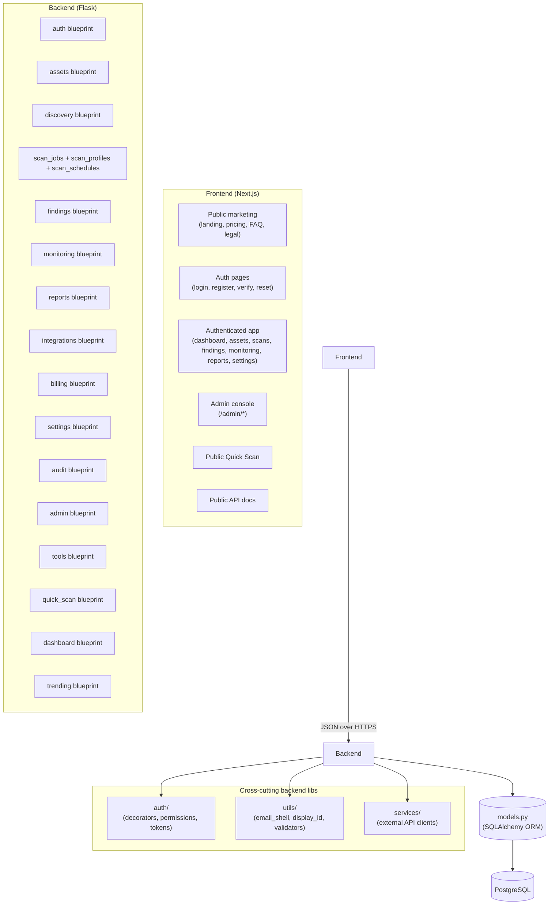
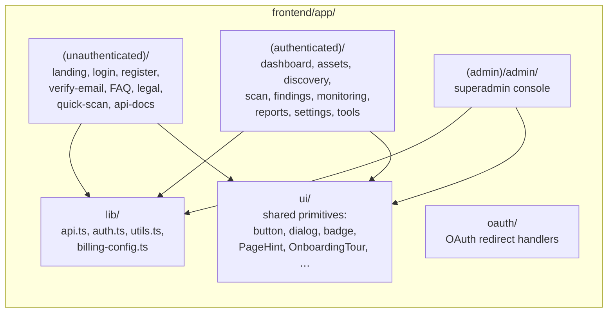

# SAD View 01 — Logical View

| Field | Value |
|---|---|
| Parent document | `03-sad.md` |
| View ID | 01 — Logical |
| Status | Draft |
| Last reviewed | 2026-05-05 |

The logical view describes the system's **functional decomposition** — how the codebase is partitioned into components, what each component owns, what depends on what. It answers the engineer's question: *"Where does the code that does X live?"*

---

## 1. High-level decomposition



The architecture is **module-per-domain-concept**, not layered (no separate "controller / service / repository" stack). Each Flask blueprint owns its own routes, request validation, business logic, and direct DB access via SQLAlchemy. This trades against pure-architecture purity for solo-engineer operability — fewer indirection layers means faster diagnosis and fewer abstractions to invent.

---

## 2. Backend module map

The backend lives at `backend/app/`. Each subfolder is a Flask blueprint or a cross-cutting library.

### 2.1 Domain blueprints

| Folder | Blueprint | URL prefix | SRS module |
|---|---|---|---|
| `auth/` | `auth_bp` | `/auth` | 01 Authentication |
| `assets/` | `assets_bp` | `/assets` | 03 Asset Management |
| `groups/` | `groups_bp` | `/groups` | 03 (asset groups) |
| `discovery/` | `discovery_bp` | `/discovery` | 04 Discovery |
| `scan_jobs/` | `scan_jobs_bp` | `/scan-jobs` | 05 Scanning |
| `scan_profiles/` | `scan_profiles_bp` | `/scan-profiles` | 05 Scanning |
| `scan_schedules/` | `scan_schedules_bp` | `/scan-schedules` | 05 Scanning |
| `findings/` | `findings_bp` | `/findings` | 06 Findings |
| `monitoring/` | `monitoring_bp` | `/monitoring` | 07 Monitoring |
| `reports/` | `reports_bp` | `/reports` | 08 Reports |
| `integrations/` | `integrations_bp` | `/integrations` | 09 Integrations |
| `billing/` | `billing_bp` | `/billing` | 10 Billing |
| `settings/` | `settings_bp` | `/settings` | 14 Settings |
| `audit/` | `audit_bp` | `/audit-log` | 11 Audit Log |
| `tools/` | `tools_bp` | `/tools` | 12 Lookup Tools |
| `quick_scan/` | `quick_scan_bp` | `/quick-scan` | 13 Public Quick Scan |
| `admin/` | `admin_bp` | `/admin` | 15 Admin Console |
| `dashboard/` | `dashboard_bp` | `/dashboard` | (cross-cutting) |
| `trending/` | `trending_bp` | `/trending` | (cross-cutting) |
| `contact/` | `contact_bp` | `/contact-requests` | (public form + trial) |

Each blueprint owns its `routes.py` (route handlers), and may own additional files (e.g., `discovery/orchestrator.py`, `scanner/orchestrator.py`).

### 2.2 Specialised pipelines

Two of the blueprints fan out into multi-module pipelines that live alongside the blueprint folder:

```
backend/app/scanner/
├── orchestrator.py          # coordinates engines + analyzers
├── templates.py             # 332 finding template registry
├── compliance_map.py        # CWE → compliance framework mapping
├── errors.py                # user-facing error sanitisation
├── engines/                 # 9 scan engines (shodan, nmap, nuclei, sslyze, …)
└── analyzers/               # 13 analyzers that turn engine output into findings

backend/app/discovery/
├── orchestrator.py          # coordinates discovery modules
├── modules/                 # 11 discovery modules
└── wordlists/               # subdomain bruteforce wordlists
```

Both pipelines follow the same shape: an **orchestrator** schedules **modules** in parallel, collects results, and persists structured rows. This commonality is documented in ADR-0008 (no separate queue) and ADR-0011 (multi-tenancy model — shared orchestrator across tenants).

### 2.3 Cross-cutting libraries

| Folder | Purpose |
|---|---|
| `auth/decorators.py` | `@require_auth`, `@require_role`, `@require_permission`, `@require_feature`, `@check_limit` |
| `auth/permissions.py` | RBAC matrix, plan-feature gating, plan-limit enforcement |
| `auth/tokens.py` | JWT issue/verify, password-reset token, email-verification token |
| `utils/email_shell.py` | Branded HTML email shell + `send_via_resend` helper |
| `utils/display_id.py` | Public ID format (e.g., `AS0042`) + `after_insert` listener |
| `utils/validators.py` | Domain / IP / CVE regex validation |
| `services/` | Shodan, GitHub, VirusTotal, AbuseIPDB API client classes |
| `extensions.py` | `db = SQLAlchemy()`, `migrate = Migrate()` instances |
| `models.py` | All SQLAlchemy models — single 60KB file (ADR-0011) |

### 2.4 The single `models.py` file

All ORM models live in one `app/models.py` file, ~1700 lines. This is **deliberate**, codified in ADR-0011:

- Cross-model foreign keys are easy to track in one place.
- Migrations generated from a single metadata namespace.
- Solo engineer doesn't need to remember which file `Asset` lives in.
- The cost (file size) is tractable; we use `Grep` not file navigation to find symbols.

If team grows beyond ~3 engineers, splitting into `models/<domain>.py` becomes worthwhile — that's a future ADR.

---

## 3. Frontend module map

Frontend lives at `frontend/app/` and uses Next.js 16 App Router.



### 3.1 Route groups

Three route groups segregate authentication boundaries (parenthesised names do not contribute to URLs):

| Route group | URL pattern | Auth requirement |
|---|---|---|
| `(unauthenticated)/` | `/`, `/login`, `/register`, `/verify-email`, `/quick-scan`, … | None |
| `(authenticated)/` | `/dashboard`, `/assets`, `/scan`, … | Logged-in user |
| `(admin)/admin/` | `/admin/*` | Logged-in superadmin (`is_superadmin=true`) |

The unauthenticated group's `layout.tsx` contains the marketing chrome. The authenticated group's `layout.tsx` mounts `<Sidebar>`, `<TopBar>`, `<OrgProvider>`, `<OnboardingTour>` and the announcement banners. The admin group's `layout.tsx` enforces the superadmin guard and provides the admin sidebar.

### 3.2 Shared frontend libraries

| Folder | Purpose |
|---|---|
| `lib/api.ts` | **Single source of truth for backend calls** — every fetch goes through `apiFetch()`. Adds `Authorization` header from `getAccessToken()`, base URL prefix, error normalisation. |
| `lib/auth.ts` | JWT storage (sessionStorage), `establishSession`, `logout`, `isLoggedIn`, `getIsSuperadmin`, impersonation helpers. |
| `lib/utils.ts` | Tailwind class merger (`cn`), small utilities. |
| `lib/billing-config.ts` | Single feature flag `BILLING_ENABLED` — gates billing UI surfaces. |
| `ui/` | Shared primitive components — `Button`, `Dialog`, `Badge`, `Skeleton`, `PageHint`, `OnboardingTour`, `PlanLimitDialog`, `ExportColumnPicker`. |
| `(authenticated)/contexts/OrgContext.tsx` | React context exposing the current user, organisation, role, permissions, plan + limit state. Mounted inside `(authenticated)/layout.tsx`. |

The frontend has **no global state library** (Redux / Zustand / Jotai). Per-page component state is sufficient at current complexity; cross-cutting concerns (org / user / role) live in `OrgContext`. This avoids state-management library churn and keeps onboarding cheap.

---

## 4. Layering rules

The codebase follows a few hard layering rules. Violations are PR-blocking.

### 4.1 Backend rules

1. **Routes never reach into another blueprint's internals.** Cross-blueprint coordination goes through models or shared helpers in `auth/` / `utils/` / `services/`.
2. **`models.py` knows nothing about Flask.** The model layer is pure SQLAlchemy + Python; it has no `request`, no `g`, no Flask imports.
3. **Decorators in `auth/decorators.py` are the only place RBAC and tenant scoping are enforced at the route layer.** Blueprints declare requirements; they don't re-implement them.
4. **External service calls go through `services/<provider>.py` classes**, not inline `requests.get()` scattered across blueprints. (See ADR-0008.) Exceptions: small one-shot internal lookup tools (`tools/`), which call upstream HTTP directly.

### 4.2 Frontend rules

1. **Every backend call goes through `lib/api.ts`.** Direct `fetch()` from a component is a code-review block.
2. **Auth state is read from `OrgContext` (or `lib/auth.ts` for the lowest-level checks).** Components don't read from sessionStorage directly.
3. **Branded chrome (sidebar, topbar, banners) lives in the route group's `layout.tsx`**, not duplicated per page.
4. **Page components own their own state and data fetching.** Sharing data between pages goes through URL params or refetching via `OrgContext.refresh()`.

---

## 5. Module dependency rules

Dependencies between backend blueprints are intentionally minimal. The dependency direction:

```
admin/    → every blueprint (cross-cutting; superadmin reaches everywhere)
audit/    → every blueprint (every blueprint emits audit logs)
billing/  → auth, settings (plan tier affects RBAC + UI)
auth/     → models only (foundational)
settings/ → auth, integrations (settings page surfaces integration config)
all domain blueprints → models, auth (decorators), utils
```

A blueprint must **not** import from another blueprint's `routes.py` (that ties their request paths together). Cross-cutting helpers go in `auth/`, `utils/`, `services/`, or `models.py`.

The `admin/` blueprint is the one place this is relaxed — admin routes deliberately reach into multiple domains, since their job is platform-wide oversight.

---

## 6. What the logical view does *not* show

The logical view is about *components and dependencies*. It does **not** show:

- **How processes run at runtime** (one Python process? Multiple? Threads vs daemons?) → see `02-runtime-view.md`.
- **How the code is deployed** (which container, which host, network paths) → see `04-deployment-view.md`.
- **How data flows through the system at scenario level** (signup, scan, payment) → see `09-key-scenarios.md`.
- **How tenants are isolated mechanically** at the query layer → see `06-security-architecture.md` §3.

Those concerns are deliberately separated to prevent any single view from sprawling.

---

*End of view 01.*
