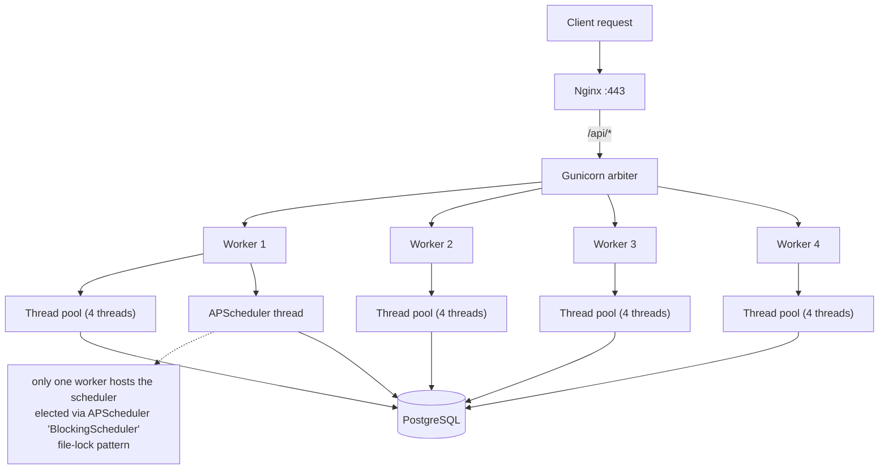
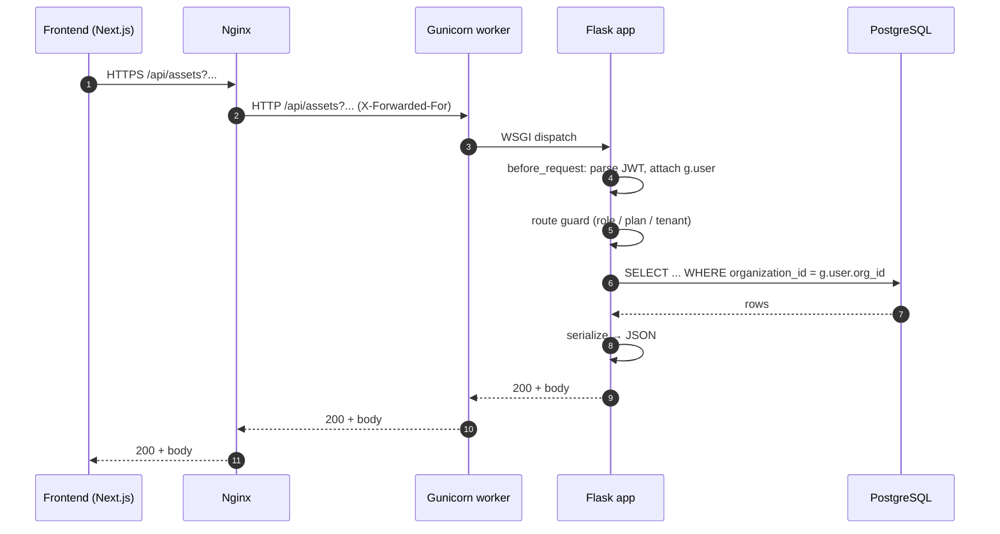

# SAD View 02 — Runtime View

| Field | Value |
|---|---|
| Parent document | `03-sad.md` |
| View ID | 02 — Runtime |
| Status | Draft |
| Last reviewed | 2026-05-05 |

The runtime view describes the system as it actually executes: processes, threads, request lifecycles, scheduled work, and how the moving parts behave under load and partial failure. Where the logical view names the boxes, this view names the activity inside them.

---

## 1. Process model

The production deployment runs **three long-lived containers** on a single EC2 host:

| Container | Image | Process | Role |
|---|---|---|---|
| `easm-frontend` | Next.js 16 standalone build | `node server.js` | Server-side rendering, static asset delivery, edge-style routing |
| `easm-backend` | Python 3.12 + Gunicorn | `gunicorn manage:app -w 4 -k gthread --threads 4` | REST API, scheduler host, all business logic |
| `easm-db` | PostgreSQL 16 | `postgres` | Primary data store |

A shared **Nginx** reverse proxy on the host (separate `~/boltedge/` compose project) terminates TLS, fronts the frontend container, and forwards `/api/*` traffic to the backend. Nginx is not part of `easm-*`; it is owned by the host operator.

**No queue. No cache. No worker fleet.** All asynchronous work is performed by a scheduler thread inside the backend Gunicorn process — see §3.

---

## 2. Backend Gunicorn topology



**Worker model:** `gthread` (gevent is not used — many of our libraries are not green-thread-safe; explicit threads are simpler to reason about under partial failure). 4 workers × 4 threads = **16 concurrent in-flight requests** per backend instance, which is sized for the t2.medium target.

**Worker recycle:** `--max-requests 1000 --max-requests-jitter 100` ensures slow leaks (typically pulled from third-party clients) get reset every ~1k requests without all workers recycling at once.

---

## 3. Scheduler thread (APScheduler)

A single APScheduler `BlockingScheduler` runs **inside one Gunicorn worker** at startup. The election uses an OS-level file lock at `/tmp/easm-scheduler.lock`:

- Worker that wins the lock owns the scheduler for its lifetime.
- If that worker dies, the lock releases, the next-started worker acquires it.
- This is acceptable because the scheduler does not hold per-second SLAs — drift of a few seconds at handover is tolerable.

**Scheduled jobs registered at boot** (see `app/__init__.py` and per-blueprint `register_scheduler` calls):

| Job | Frequency | Module | Purpose |
|---|---|---|---|
| `monitoring.run_due_monitors` | every 5 min | `monitoring/` | Pick monitors whose `next_run_at <= now`, queue scans |
| `scan_schedules.run_due_schedules` | every 5 min | `scan_schedules/` | Same idea, for user-defined recurring scans |
| `billing.expire_trials` | every 1 h | `billing/` | Downgrade orgs whose trials have ended |
| `billing.expire_free_tier` | every 6 h | `billing/` | Login-block Free orgs at 90d, hard-delete at 120d (FR-BILL-002) |
| `audit.purge_expired_audit` | daily 02:00 UTC | `audit/` | Drop audit rows past per-tier retention |
| `quick_scan.purge_old_logs` | daily 03:00 UTC | `quick_scan/` | Trim the unauthenticated quick-scan log |

**Job execution model:** each job runs synchronously on the scheduler thread, then dispatches actual scan work to a `ThreadPoolExecutor(max_workers=8)` so that one slow scan does not block the next tick. The executor is shared across jobs.

**Failure isolation:** every job runs inside `try / except Exception` with a `current_app.logger.exception(...)` call. A failing job logs and continues; it never takes the scheduler down.

---

## 4. Request lifecycle (authenticated API)



**Per-request invariants:**
- JWT is decoded once per request in a `before_request` hook; `g.user` is the *only* trusted identity reference downstream. Routes never re-parse the token.
- Tenant scoping is enforced in the **query**, not at serialisation time. Any `Asset.query.filter_by(organization_id=g.user.org_id)` is the canonical pattern. Routes that bypass this without a comment explaining why are bugs.
- Database session is opened per request (Flask-SQLAlchemy default) and rolled back on exception via the `teardown_request` hook.

---

## 5. Long-running work (scans, discovery)

Scans and discovery jobs are **kicked off synchronously from the request thread** but executed on a background thread so the HTTP request returns within ~200 ms with `202 Accepted` and a job id. The client polls the job-status endpoint.

```mermaid
sequenceDiagram
    autonumber
    participant FE as Frontend
    participant API as Backend (request thread)
    participant TP as ThreadPoolExecutor
    participant DB as PostgreSQL
    participant EXT as External APIs (Shodan, etc.)

    FE->>API: POST /scan/jobs {asset_id, profile}
    API->>DB: INSERT scan_job (status=queued)
    API->>TP: submit(run_scan, job_id)
    API-->>FE: 202 {job_id}
    Note over TP,DB: returns immediately; scan continues async
    TP->>DB: UPDATE scan_job (status=running)
    TP->>EXT: query Shodan, run nuclei, etc.
    EXT-->>TP: results
    TP->>DB: INSERT findings; UPDATE scan_job (status=completed)
    FE->>API: GET /scan/jobs/<id> (polled)
    API->>DB: SELECT scan_job
    DB-->>API: row
    API-->>FE: 200 {status, progress}
```

**Why a thread pool, not Celery / RQ:** see ADR 0004. Short version: single-host deployment, modest throughput target, no operational appetite for a broker. Re-evaluate when concurrency exceeds ~50 concurrent scans or when we need cross-host scaling.

**Backpressure:** the executor has a bounded queue (configured at `max_workers * 4`). When full, scan-kickoff routes return `503 SCAN_CAPACITY` with `Retry-After`. The user-facing copy is "scanner busy, try again in a moment."

---

## 6. Concurrency hazards we accept

| Hazard | Where | Mitigation |
|---|---|---|
| Scheduler tick fires while previous tick still running | scheduled jobs | Each job sets a row-level advisory lock (`pg_try_advisory_lock`) per `monitor_id` / `schedule_id` to prevent overlap |
| Two workers both winning scheduler election briefly during restart | scheduler boot | File lock; worst-case is 1–2 duplicate ticks, idempotent due to advisory lock above |
| User clicks "scan" twice rapidly | scan-kickoff route | Idempotency by `(asset_id, profile_id, status='queued'\|'running')` lookup before insert; second click returns the existing job |
| External API timeout cascades into slow request thread | scanner / discovery | Per-call timeouts (Shodan 10s, HTTP probe 5s); circuit-breaker pattern in `services/` clients |

---

## 7. Error handling and sanitisation

A global Flask error handler converts every exception into the canonical JSON shape `{ "error": "...", "code": "..." }`. The handler:

1. Logs the full stack trace via `current_app.logger.exception(...)`.
2. Maps known `ApiException` subclasses to their HTTP status + code.
3. Maps unknown exceptions to `500 INTERNAL_ERROR` and **does not leak the message** — the client sees only the generic copy. The Sentry / log line carries the detail (NFR-SEC-018).

Stack traces are **never returned to the client**, even in development mode for non-localhost origins. The `DEBUG=True` Flask flag is set only when running `python run.py` locally; Gunicorn deploys force `DEBUG=False`.

---

## 8. Graceful degradation

External services we depend on but can survive without:

| Service | What breaks if down | What we do |
|---|---|---|
| Shodan | Service / port enrichment | Scanner skips Shodan-dependent analyzers, logs `service_unavailable`, returns partial results with a warning surfaced to the UI |
| Resend | Outbound email | Pending emails queued in `outbound_email` table with `status=pending`; retry job picks them up. User-facing flows do not block on email send |
| Stripe | Checkout, billing portal | UI shows "billing temporarily unavailable, try again in a few minutes." No data loss; existing plan state is in our DB |
| Recaptcha | Public quick-scan, registration | Hard fail (we don't accept anonymous traffic without bot defence). Returns 503 with explanation |

External service degradation is logged at WARN, not ERROR — they are expected occasionally and pages on every Shodan blip would be noise. Sustained degradation (>5 min, >10% error rate) escalates via the alerting rules in §05-data-architecture.md follow-on / observability view.

---

## 9. Startup and shutdown sequence

**Startup (per backend container):**
1. Gunicorn arbiter spawns N workers.
2. Each worker imports `manage.py`, which calls `create_app()`.
3. `create_app()` registers blueprints, error handlers, CORS, JWT extension, SQLAlchemy.
4. One worker wins the scheduler file lock and calls `init_scheduler()`, registering all scheduled jobs.
5. Workers begin accepting requests.

**Shutdown (SIGTERM from `docker compose down` or container restart):**
1. Gunicorn arbiter receives SIGTERM, propagates to workers.
2. Workers stop accepting new connections, finish in-flight requests up to `--graceful-timeout 30`.
3. Scheduler-owning worker calls `scheduler.shutdown(wait=True)` — running scheduled jobs complete, no new ones start.
4. After 30 s grace, any worker still alive is SIGKILLed.
5. In-flight scans tracked via `scan_job.status='running'` are **not** rolled forward at next boot — see §10.

---

## 10. In-flight scan recovery

If a backend container dies while scans are running, those scans are left with `status='running'` in the DB. On boot, `init_scheduler()` runs a one-shot **reconciliation pass**:

- Scan jobs with `status='running'` and `last_heartbeat_at < now() - INTERVAL '15 minutes'` are marked `status='failed'` with `error_code=BACKEND_RESTART`.
- Findings already written are kept (idempotent inserts via `(scan_job_id, finding_template_id, target)` uniqueness).
- The user sees the failed job in the UI and may rerun.

We do not auto-resume. Scan idempotency is per-finding, not per-job, and partial-resume logic introduces more bugs than it solves at this scale.

---

## 11. What runtime view does not show

- Code organisation, build, CI/CD → §03-development-view
- Container layout, host topology, scaling path → §04-deployment-view
- Schema, retention, ERD → §05-data-architecture
- Auth flow internals, encryption-at-rest detail → §06-security-architecture
- Logging / metrics / dashboards → §08-observability
- Specific user-facing flows (registration, scan kickoff sequence) → §09-key-scenarios

---

*End of view 02 — Runtime.*
