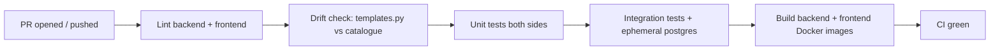

# SAD View 03 — Development View

| Field | Value |
|---|---|
| Parent document | `03-sad.md` |
| View ID | 03 — Development |
| Status | Draft |
| Last reviewed | 2026-05-05 |

The development view describes how the codebase is organised on disk, how developers work in it, and how changes flow from a local edit to a running production container. It is the view a new engineer reads on their first day.

---

## 1. Top-level repository layout

```
boltedge-easm/
├── backend/                    # Flask API + scheduler
│   ├── app/                    # blueprints, models, services
│   ├── migrations/             # Alembic
│   ├── scripts/                # one-off + housekeeping scripts
│   ├── tests/                  # pytest suite
│   ├── manage.py               # gunicorn entrypoint
│   ├── run.py                  # local dev entrypoint
│   ├── requirements.txt
│   └── Dockerfile
├── frontend/                   # Next.js 16 app
│   ├── app/                    # App Router pages + components
│   ├── public/
│   ├── package.json
│   ├── next.config.ts
│   └── Dockerfile
├── docs/
│   ├── sdlc/                   # SRS, SAD, etc.
│   ├── adr/                    # architectural decision records
│   ├── finding-templates.md    # generated catalogue
│   └── ...
├── docker-compose.yml          # local + production composition
├── .pre-commit-config.yaml
├── CLAUDE.md                   # AI-assistant rules + project rules of the road
└── README.md
```

Backend and frontend are siblings — never sub-packages of one another. They communicate **only** over HTTP. Shared types are documented in the SRS / API docs, not exchanged via a shared library, to keep the deployment story symmetric.

---

## 2. Backend code organisation

```
backend/app/
├── __init__.py             # app factory, blueprint registration, error handlers
├── models.py               # all SQLAlchemy models (single file — see ADR 0011)
├── auth/                   # blueprint + permissions + JWT helpers
├── assets/                 # blueprint + intelligence enrichment
├── discovery/              # blueprint + orchestrator + 11 modules
├── scanner/                # blueprint + orchestrator + 9 engines + 13 analyzers + templates
├── findings/
├── monitoring/
├── reports/
├── integrations/
├── billing/
├── groups/
├── tools/
├── dashboard/
├── trending/
├── settings/
├── scan_jobs/
├── scan_profiles/
├── scan_schedules/
├── quick_scan/
├── audit/
├── admin/                  # platform superadmin
├── services/               # external API clients (Shodan, VirusTotal, etc.)
└── utils/                  # validators, formatters, exceptions
```

### 2.1 Per-blueprint conventions

Each business blueprint (e.g. `assets/`) typically contains:

```
assets/
├── __init__.py             # blueprint = Blueprint("assets", ...)
├── routes.py               # HTTP endpoints
├── service.py              # business logic, called by routes
├── schemas.py              # request/response validation (Pydantic or Marshmallow)
└── tests/                  # blueprint-scoped tests
```

The pattern is loose — small modules collapse `service.py` into `routes.py`, large ones split further. The non-negotiable rules:

- **Routes contain no business logic that another blueprint might want.** If two blueprints would need it, it belongs in `service.py` or a shared `utils/`.
- **Routes never import from another blueprint's `routes.py`.** Cross-blueprint calls go through `service.py` modules or models.
- **Models are imported from `app.models`, never redefined per-blueprint.**

### 2.2 Specialised packages

- `scanner/` and `discovery/` are larger than other blueprints because they coordinate sub-pipelines. Each has its own `orchestrator.py` and a flat list of pipeline modules. See §01-logical-view §2.2.
- `services/` has no blueprint — it is a library of clients used by other modules. No HTTP routes.
- `utils/` is the dumping ground for formatters, validators, custom exceptions. Code that grows beyond a single file's worth of utilities should graduate to its own package.

---

## 3. Frontend code organisation

```
frontend/app/
├── (unauthenticated)/      # landing, login, register, quick-scan, public tools
├── (authenticated)/        # all logged-in pages — dashboard, assets, scans, etc.
│   └── admin/              # superadmin pages (404 to non-superadmins server-side)
├── api/                    # Next.js route handlers (currently minimal — most calls proxy directly)
├── lib/                    # api.ts, auth helpers, billing-config, utils
├── ui/                     # reusable components (Button, Modal, Table, Badge, ...)
├── Sidebar.tsx
├── TopBar.tsx
├── layout.tsx              # root layout
└── globals.css             # Tailwind base
```

### 3.1 Route group conventions

- **`(unauthenticated)/`** — anonymous-accessible. Layout has no sidebar / topbar. Calling protected APIs from here is a bug.
- **`(authenticated)/`** — wrapped in an auth guard layout that redirects to `/login` if no JWT. Sidebar + TopBar present.
- **`admin/`** — nested under authenticated, additionally guarded by `is_superadmin` server-side. Frontend-side guard is cosmetic; the backend returning 404 is what actually protects it.

### 3.2 Component conventions

- Page components live under `app/(authenticated)/<area>/page.tsx`. Page-private components live in the same folder.
- Reusable components live in `app/ui/`. The bar for promoting to `ui/` is "used by 2+ pages."
- All API calls go through `app/lib/api.ts`. Pages never call `fetch` directly — this guarantees JWT injection, error normalisation, and base-URL handling.

### 3.3 Styling

Tailwind CSS only. No CSS modules, no styled-components, no inline `<style>`. The dark theme is built on CSS variables in `globals.css`; brand teal (`#14b8a6`) is `--accent`.

---

## 4. Local development workflow

### 4.1 First-time setup

```bash
# Postgres
createuser easm_user --pwprompt        # password: localdevpassword
createdb easm -O easm_user

# Backend
cd backend
python -m venv .venv
source .venv/bin/activate              # or .venv\Scripts\activate on Windows
pip install -r requirements.txt
flask db upgrade

# Frontend
cd ../frontend
npm install

# pre-commit (recommended)
pip install pre-commit
pre-commit install
```

Required env vars are listed in the project `CLAUDE.md`. The backend reads from `.env` (or `os.environ` directly); the frontend reads from `.env.local`.

### 4.2 Running both sides

Two terminals:

```bash
# terminal 1 — backend
cd backend
python run.py            # Flask dev server, port 5000, autoreload

# terminal 2 — frontend
cd frontend
npm run dev              # Next.js dev server, port 3000, autoreload
```

The frontend's `NEXT_PUBLIC_API_BASE_URL=http://localhost:5000/api` connects them. CORS is configured to allow `http://localhost:3000` in development.

### 4.3 Branch strategy

- **`master`** is the trunk and the deploy target. Production deploys from `master`.
- Feature work happens on short-lived branches: `feat/<scope>`, `fix/<scope>`, `chore/<scope>`.
- Branches merge via PR (squash merge) once CI is green and review is recorded — even when the reviewer is the only other engineer.
- No long-lived `develop` branch. No release branches. Hotfixes are PRs onto `master` like any other change.

### 4.4 Commit conventions

- Imperative mood ("Add X", not "Added X").
- Subject under ~70 chars; body wraps at 100.
- Reference an SRS FR / NFR id when the change implements a tracked requirement, e.g. `FR-AUTH-013: TOTP enrolment endpoint`.
- AI-assisted commits include the standard `Co-Authored-By: Claude ...` trailer (CLAUDE.md rule).

---

## 5. Test strategy (development-view scope)

The full strategy is in the forthcoming **06 Test Strategy** document. From the development-view perspective:

| Layer | Tool | Where | What it covers |
|---|---|---|---|
| Backend unit | `pytest` | `backend/tests/` | Pure-function logic, validators, formatters, scoring math |
| Backend integration | `pytest` + ephemeral Postgres | `backend/tests/integration/` | Routes end-to-end with real DB; tenant scoping; permission gates |
| Frontend unit | `vitest` | colocated `*.test.tsx` | Component behaviour, hook logic |
| End-to-end | Playwright | `e2e/` (planned) | Critical user journeys: signup → first scan → finding view |

**Test rules:**
- Integration tests **must** hit a real Postgres (per CLAUDE.md feedback). Mocks of the DB are forbidden in this layer.
- Unit tests must not require a DB or external network. If a test needs both, it is an integration test.
- Coverage targets are not enforced as a hard CI gate — coverage is reported but the bar is judgement, not a number.

---

## 6. Continuous integration

CI runs on every PR via GitHub Actions (`.github/workflows/ci.yml`):



- **Lint:** `ruff` + `mypy` on backend; `eslint` + `tsc --noEmit` on frontend.
- **Drift check:** `python backend/scripts/generate_catalogue.py --check` — fails if `docs/finding-templates.md` is out of sync with `templates.py`.
- **Build:** images are built but **not pushed**. Production deploys still pull from `master` and build on the EC2 host (see §04-deployment-view). The CI build is a smoke test that the Dockerfiles are healthy.

CI takes ~6 minutes end-to-end on a fresh PR; ~3 minutes on a re-run with cached layers.

---

## 7. Pre-commit hooks

`.pre-commit-config.yaml` runs locally on every commit:

| Hook | Purpose |
|---|---|
| `ruff` (format + lint) | Backend Python style |
| `eslint --fix` | Frontend |
| `templates-catalogue-regen` | Re-runs catalogue generator if `templates.py` is staged; fails the commit if the catalogue is dirty |
| `templates-catalogue-check` | Drift check on every commit |
| `no-bolt-edge-string` | Greps the diff for `BoltEdge` references — fails the commit if found (CLAUDE.md rule #1) |

Devs without pre-commit installed are caught by the same checks in CI; pre-commit just shortens the loop.

---

## 8. Database migrations

Schema changes flow through Flask-Migrate / Alembic:

```bash
# After editing models.py
flask db migrate -m "describe the change"
# inspect the generated migration in backend/migrations/versions/
flask db upgrade

# Rolling back
flask db downgrade
```

**Rules:**
- Every migration is reviewed by hand before commit. Auto-generated migrations frequently miss things (default-value coercions, index renames).
- Migrations are **append-only** in production. Once a migration is on `master`, it is not edited — a follow-up migration corrects it.
- Migrations should be **idempotent** where possible (`IF NOT EXISTS` clauses on indexes; defensive checks).
- Data migrations live in the migration script too, but heavy backfills (>100k rows) are split into a separate one-off script in `backend/scripts/` and invoked manually post-deploy.

---

## 9. Generated artefacts

| Artefact | Source | Generator | Where it lives |
|---|---|---|---|
| `docs/finding-templates.md` | `backend/app/scanner/templates.py` | `backend/scripts/generate_catalogue.py` | Committed to repo, kept in sync via pre-commit |
| Compliance mappings rendered in UI | `backend/app/scanner/compliance_map.py` | served live via API | not committed in rendered form |
| API docs at `/api-docs` | OpenAPI spec (FR-API-008 — gap) | runtime-rendered | not committed |

Generated files are committed when a human-friendly diff matters in code review (the catalogue is one). Otherwise they are rendered at runtime.

---

## 10. Dependency management

- **Backend:** `requirements.txt` is pinned to specific versions. We do not use `pip-tools` or `poetry` — overhead is not worth it at this size. Upgrades happen quarterly, in a dedicated PR, with the test suite as the regression check.
- **Frontend:** `package-lock.json` is committed. `npm ci` is used in CI and Docker builds for reproducibility. `npm install` is local-only.

Major version upgrades (Next.js, Flask, SQLAlchemy) are their own PRs, reviewed against the relevant changelog.

---

## 11. Code review rules

- Every PR has at least one reviewer who is not the author.
- AI-assisted changes are reviewed by a human with the same care as a human-authored change.
- The reviewer is responsible for catching: scope creep (CLAUDE.md "no surrounding cleanup"), security regressions, schema breakage, and tenant-scoping drift.
- Approval is recorded in GitHub. PR descriptions follow the template: **Summary**, **Test plan**, optional **Screenshots**.

---

## 12. What development view does not show

- How the running system actually executes → §02-runtime-view
- Production hosts and container topology → §04-deployment-view
- Domain model and schema details → §05-data-architecture
- Threat model — separate doc, **04 Threat Model**

---

*End of view 03 — Development.*
