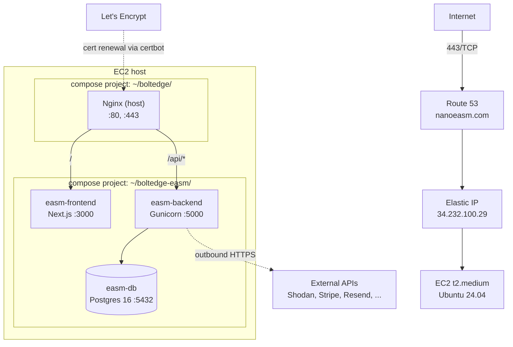

# SAD View 04 — Deployment View

| Field | Value |
|---|---|
| Parent document | `03-sad.md` |
| View ID | 04 — Deployment |
| Status | Draft |
| Last reviewed | 2026-05-05 |

The deployment view describes the physical and infrastructure topology Nano EASM runs on: hosts, containers, network paths, secrets, deploy mechanics, and the scaling path from "single box" to "first horizontal step" when growth demands it.

---

## 1. Production topology (current)

Nano EASM runs as a **single-host deployment** on AWS EC2.



**Key facts:**

| Concern | Choice | Note |
|---|---|---|
| Host | EC2 t2.medium, Ubuntu 24.04 | 2 vCPU, 4 GB RAM |
| Public IP | Elastic IP `34.232.100.29` | Static, reserved |
| DNS | Route 53 — `nanoeasm.com` A record → Elastic IP | TTL 300 |
| TLS | Let's Encrypt via certbot, renews on host | 90-day rotation |
| Reverse proxy | Nginx on host, in compose project `~/boltedge/` | Owned separately so other apps can share it |
| App containers | Docker Compose project `~/boltedge-easm/` | 3 containers: frontend, backend, db |
| Storage | EBS gp3 80 GB, attached to EC2 | Postgres data + container volumes |
| Backups | Nightly `pg_dump` via cron + EBS snapshot | See §08 Backup & DR (separate doc) |

---

## 2. Container composition

`docker-compose.yml` defines the three application containers. Definitions are environment-agnostic; secrets come from `.env` on the host.

| Container | Image source | Ports (internal) | Volumes | Restart |
|---|---|---|---|---|
| `easm-frontend` | built from `frontend/Dockerfile` | 3000 | – | `unless-stopped` |
| `easm-backend` | built from `backend/Dockerfile` | 5000 | `./backend/logs:/app/logs` | `unless-stopped` |
| `easm-db` | `postgres:16` | 5432 | `easm_db_data:/var/lib/postgresql/data` | `unless-stopped` |

**Network:** all three containers join the default compose bridge network. Only Nginx on the host reaches `easm-frontend:3000` and `easm-backend:5000`. Postgres is **not** exposed to host or internet — only the backend container talks to it.

**The frontend Docker image bakes `NEXT_PUBLIC_*` env vars at build time** (Next.js inlines them into the client bundle). Any env-var change for a `NEXT_PUBLIC_*` value requires `docker compose build --no-cache easm-frontend`. This is a sharp edge that has bitten us; the deploy script forces `--no-cache` whenever `frontend/.env.production` is touched.

---

## 3. Nginx (host) configuration

Nginx lives in a separate compose project at `~/boltedge/` so it can front multiple apps on the same EC2 if needed. The `nanoeasm.com` server block:

- Listens 80, redirects to 443.
- Listens 443 with the Let's Encrypt cert.
- `location /` → `proxy_pass http://easm-frontend:3000`.
- `location /api/` → `proxy_pass http://easm-backend:5000`.
- Standard hardening headers: `Strict-Transport-Security`, `X-Content-Type-Options`, `X-Frame-Options`, `Content-Security-Policy` (frame-ancestors locked down), `Referrer-Policy`.
- Client body limits: 10 MB (covers report uploads).
- Proxy timeouts: 60 s read (covers slow scan-status polling).

certbot renews the cert via a host cron job. Nginx auto-reloads on cert update.

---

## 4. Environment variables and secrets

### 4.1 On the EC2 host

Two files, both `chmod 600`, owned by the deploy user:

- `~/boltedge-easm/.env` — application secrets (DB password, JWT secret, Stripe keys, Resend key, Shodan key, etc.)
- `~/boltedge-easm/frontend/.env.production` — `NEXT_PUBLIC_*` build-time values

Compose reads `.env` automatically; the frontend Dockerfile copies `.env.production` during build.

### 4.2 Secret management approach

We do **not** currently use AWS Secrets Manager / SSM Parameter Store. Secrets sit in the `.env` file on the host. This is acceptable while we have one host and a tiny ops footprint, but it is the first thing to change when we add a second host or onboard a second engineer who should not see all secrets. See "scaling path" §10.

### 4.3 Secret rotation

| Secret | Rotation cadence | Mechanism |
|---|---|---|
| `SECRET_KEY` (JWT signing) | On compromise only | Edit `.env`, restart backend; invalidates all sessions |
| `STRIPE_*` | When Stripe rotates | Pull from dashboard, edit `.env`, restart |
| `RESEND_API_KEY`, `SHODAN_API_KEY` | Annually + on compromise | Same |
| Postgres password | Annually | Update DB user, edit `.env`, restart `easm-db` + `easm-backend` together |
| TLS cert | Every 60–90 days, automatic | certbot |

---

## 5. Deploy procedure

The current procedure is intentionally simple — git pull, rebuild, restart.

```bash
# On EC2 (manual, not yet automated)
cd ~/boltedge-easm
git pull origin master
docker compose up -d --build
docker compose logs -f easm-backend         # sanity-check boot
```

**With migrations:**

```bash
git pull origin master
docker compose up -d --build easm-backend easm-frontend
docker compose exec easm-backend flask db upgrade
docker compose restart easm-backend
```

**With NEXT_PUBLIC_* env-var change:**

```bash
docker compose build --no-cache easm-frontend
docker compose up -d easm-frontend
```

### 5.1 Rollback

`git checkout <prev-sha> && docker compose up -d --build`. Database migrations are **not** auto-rolled-back — schema changes are forward-only by convention. If a migration is genuinely broken in production, the procedure is:

1. Roll the app back to the previous SHA.
2. Investigate.
3. Write a corrective forward migration.
4. Roll forward.

This is the standard "expand/contract" discipline; it is enforced by code review, not tooling.

### 5.2 Zero-downtime?

**No, today.** A `docker compose up -d --build` causes a brief request blip (typically 5–15 s) during container swap. Acceptable while we are pre-revenue / single-customer-tier.

The path to zero-downtime requires either (a) two backend containers behind Nginx upstream with rolling restart, or (b) moving to ECS / Fargate with a load balancer. Both are scaling-step decisions, not day-1 needs.

---

## 6. Other environments

### 6.1 Local development

- Postgres on host (not Docker), `localhost:5432`.
- Backend run via `python run.py` (Flask dev server).
- Frontend run via `npm run dev`.
- See §03-development-view §4.

### 6.2 Staging

**There is no persistent staging environment today.** Pre-production verification happens locally and via PR-level CI. This is a known gap; it is acceptable while the customer base is small enough that a botched deploy can be rolled back inside minutes without contractual fallout.

When we add staging, the intended shape is:
- Same EC2 architecture, smaller instance (t3.small).
- Subdomain `staging.nanoeasm.com`.
- Auto-deploys from `master` after CI; manual promotion gate to production.

---

## 7. Data residency and region

- Production region: **AWS `us-east-1`** (Northern Virginia).
- Customer data (assets, scan results, findings, audit log) sits in this region's Postgres.
- This is documented to customers in the SRS (Module 16) and DPA. EU customers are advised; we do not currently offer an EU region. See "scaling path" §10.

---

## 8. External services and outbound network

The backend container makes outbound HTTPS calls to:

| Service | Purpose | Failure mode |
|---|---|---|
| `api.shodan.io` | Service / port enrichment for scans | Graceful degradation (§02-runtime §8) |
| `api.stripe.com` | Billing checkout, subscription, webhooks | Customer-facing billing flow blocks; existing access unaffected |
| `api.resend.com` | Transactional email | Queued and retried |
| `www.virustotal.com`, `api.abuseipdb.com` | Optional enrichment | Skipped if key missing or down |
| `crt.sh`, public DNS resolvers | Discovery | Discovery module reports partial result |

Outbound is unrestricted from the EC2 instance (default security group). Inbound is restricted to 80, 443, and SSH from the operator IP.

---

## 9. Logging and metrics in deployment

- Container `stdout` / `stderr` is captured by the Docker daemon, default `json-file` driver.
- Backend additionally writes structured logs to `./backend/logs/app.log` (mounted), rotated at 100 MB × 5 files.
- No external log aggregator wired today — `docker compose logs` and `tail` are the operator's tools. Replacing this with a hosted log sink (CloudWatch, Better Stack, Loki) is on the **08 Observability** view follow-on.
- Metrics: not exported today. Health is checked via `GET /health` and the admin **Health** page (`/admin/health`).

---

## 10. Scaling path

The single-EC2 deployment is fit-for-purpose at current load. The growth steps, in order, are:

1. **Vertical first.** t2.medium → t3.large → t3.xlarge buys us roughly 4× before any architectural change. Cheapest, least risk.
2. **Split the database off the app host.** Move Postgres to RDS (single-AZ first, multi-AZ when revenue justifies). Removes the largest single-machine failure mode.
3. **Externalise secrets.** Move `.env` to AWS Secrets Manager / Parameter Store. Required before adding a second app host (otherwise secrets sprawl).
4. **Move the app behind ALB with two backend containers.** Either two EC2s in an ASG, or migrate to ECS/Fargate. Enables rolling deploys and zero-downtime restarts.
5. **Decouple long-running scans onto worker hosts.** First time we genuinely need a queue (Redis + RQ, or SQS). Probably ~50+ concurrent scan throughput.
6. **Multi-region.** EU region for residency-sensitive customers. Each region runs the full stack; customers are pinned to one region at signup.

Each step is **independently triggerable**: nothing in steps 4–6 requires steps 1–3 to be done in a specific order, but the dependencies (separate DB before separate app hosts; secrets manager before fleet expansion) need to hold.

---

## 11. Failure domains

| Failure | Blast radius | Recovery |
|---|---|---|
| Backend container crash | Brief 502 from Nginx; auto-restarted by Docker | < 30 s |
| Frontend container crash | Server-rendered pages 502; auto-restarted | < 30 s |
| Postgres container crash | Full outage (everything depends on DB); auto-restarted | < 60 s + WAL replay |
| EBS volume corruption | Full outage, restore from latest `pg_dump` | RPO ≤ 24 h, RTO ~1 h |
| EC2 instance failure | Full outage, launch new instance from AMI + restore data | RTO ~2 h |
| AZ outage | Full outage (single-AZ deployment) | Manually relaunch in another AZ |
| Region outage | Full outage | No DR plan today; documented in 08 Backup & DR |

The **08 Backup & DR** document covers the recovery runbooks in operational detail. This view records only the failure surface.

---

## 12. What deployment view does not show

- Per-process behaviour, scheduler election → §02-runtime-view
- Code organisation, deploy-time build pipeline (CI) → §03-development-view
- Schema and data retention → §05-data-architecture
- Auth flows, secrets handling at code level → §06-security-architecture
- Stripe / Resend / Shodan integration internals → §07-external-integrations
- Backup procedures, runbooks → **08 Backup & DR** (separate doc)

---

*End of view 04 — Deployment.*
