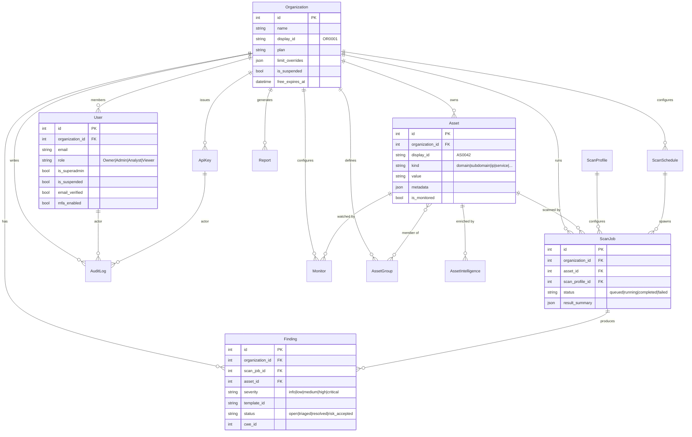
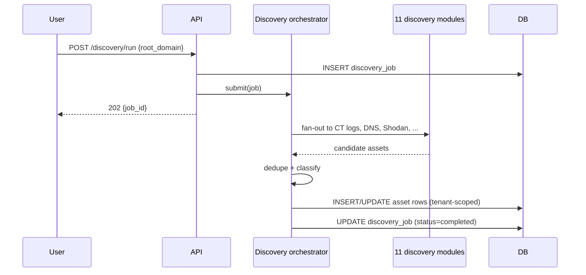
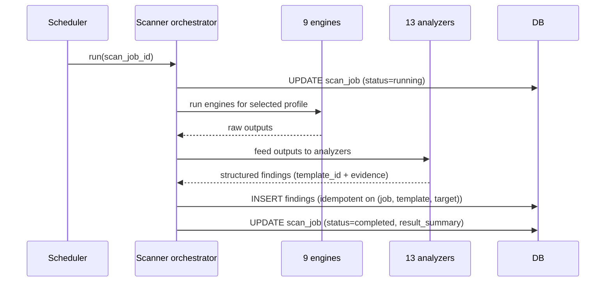
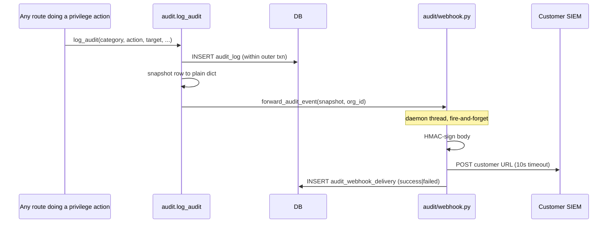

# SAD View 05 — Data Architecture

| Field | Value |
|---|---|
| Parent document | `03-sad.md` |
| View ID | 05 — Data |
| Status | Draft |
| Last reviewed | 2026-05-05 |

The data view describes the persistent state of Nano EASM: domain entities, the relationships between them, multi-tenancy enforcement, retention, and how data flows through major operations.

---

## 1. Storage technologies

| Store | Use | Where |
|---|---|---|
| PostgreSQL 16 | Primary datastore — all transactional and analytical data | `easm-db` container |
| Filesystem | Generated reports (PDF/Excel), backend logs | EC2 EBS volume |
| `easm_db_data` Docker volume | Postgres data dir | Backed by EBS |

There is no separate cache, search index, or object store today. The single-Postgres choice is a deliberate simplification (ADR 0003); JSON columns absorb things that would otherwise be a second store.

---

## 2. High-level domain model

The diagram above is the domain skeleton. The full schema has more tables (audit detail, billing, integrations, monitoring history, quick-scan log, blocked IPs, announcements, contact requests, audit-webhook deliveries, etc.); they hang off `Organization` the same way.

---

## 3. Multi-tenancy: shared schema, tenant-scoped queries

Nano EASM uses a **single PostgreSQL database, shared schema, tenant-id discriminator** model (ADR 0011). Every tenant-scoped table carries `organization_id`.

### 3.1 Why this model

| Alternative | Why we rejected |
|---|---|
| Database-per-tenant | Migration storm at every schema change; backup multiplication; expensive at our customer count |
| Schema-per-tenant | Same migration storm at slightly less cost; SQLAlchemy support is awkward |
| Shared schema (chosen) | Cheap, simple, well-supported; tenant scoping is enforced in code |

### 3.2 How scoping is enforced

Three layers, defence-in-depth:

1. **Query filter** — every read of a tenant-scoped model goes through `.filter_by(organization_id=g.user.org_id)`. Drift here is the single largest source of cross-tenant leak risk; code review treats unscoped queries as a high-priority finding.
2. **Route decorator** — `@require_org_member` confirms `g.user` belongs to the URL-referenced org and raises 403 otherwise. Used on routes that take an org id in the path.
3. **Foreign key chain** — child rows (e.g. `Finding`) have their *own* `organization_id`, redundantly with the parent. This makes the top-level filter sufficient; we don't have to recursively walk parent chains in every query.

The redundant `organization_id` denormalisation is deliberate. NFR-SEC-008 requires single-filter scoping at the leaf table — this prevents the "I forgot to JOIN through Asset" class of leak.

### 3.3 Cross-tenant operations (intentional)

Some operations span tenants by design:

| Operation | Why | Guard |
|---|---|---|
| `/admin/*` superadmin views | Platform operations | `require_superadmin` decorator (re-fetches user from DB on each request) |
| Scheduler ticks | `monitoring.run_due_monitors` reads across orgs | Runs server-side, no user context, writes scoped per-row |
| Billing webhooks | Stripe webhook hits one endpoint, dispatches to the correct org | Org id resolved from Stripe customer id, then scoped |

Cross-tenant operations are loud (audit-logged, often with `organization_id=NULL` for platform-level actions, see §3.4).

### 3.4 The audit log's nullable `organization_id`

`audit_log.organization_id` is **nullable**. A non-null value indicates a tenant action (scoped to that org). A null value indicates a platform-level action (e.g. superadmin grant, broadcast, IP block). Per-org audit views filter `organization_id = X`; the platform audit view shows everything including the nulls.

---

## 4. The `models.py` single-file convention

All SQLAlchemy models live in one file: `backend/app/models.py` (~60 KB). Per-blueprint files do **not** redefine models. Why:

- One place to grep for any column.
- Foreign keys resolve without import gymnastics.
- Alembic auto-generation has the full picture.

The cost is a long file. The benefit is that anyone reading two related models reads them in the same buffer. We have not hit a maintainability ceiling at the current size; if we do, the split would be by domain (assets, scans, billing) rather than by blueprint.

---

## 5. Display IDs vs database IDs

User-facing tables of interest carry a **display id**: `AS0042` for assets, `SC0010` for scan jobs, `FD2317` for findings, `OR0001` for orgs, etc. These are short, prefixed, monotonic per-tenant identifiers. The database primary key remains an integer; the display id is a separate column with a unique constraint scoped to tenant.

URLs and API responses use the display id. The API also accepts the integer pk for convenience (FR-API-013), but the display id is canonical.

---

## 6. JSON columns

Several models use `JSON` (Postgres `jsonb`) columns for structured-but-evolving data:

| Column | Purpose | Why JSON |
|---|---|---|
| `Organization.limit_overrides` | Per-org overrides on plan defaults | Sparse, varies wildly across customers |
| `Asset.metadata` | Per-asset enrichment (services, headers, tags) | Schema differs per asset kind |
| `Finding.evidence` | Raw scan output that supports the finding | Engine-specific shape |
| `ScanJob.result_summary` | Aggregate counts + flags for a completed scan | Flexible aggregation |
| `Report.parameters` | Render parameters used to generate the report | Per-template options |

JSON columns are searched via `jsonb` operators when needed. Columns we filter or sort on regularly are **promoted to first-class columns**. The rule: JSON for "data we display," real columns for "data we query."

---

## 7. Key relationships and invariants

### 7.1 Asset graph
- An **Asset** is `kind ∈ {domain, subdomain, ip, service, certificate, ...}`.
- The **discovery orchestrator** writes new Assets attributed to the org of the seed root domain.
- Assets are **soft-deleted** (a `deleted_at` column) so historical findings still link to a recognisable record. Hard delete only happens on `Organization` cascade.

### 7.2 Scan job → finding
- Findings are produced *by* a scan job. The link is mandatory.
- Re-scans of the same asset produce **new** findings, not updates to old ones. Comparison across runs is done by the scan-comparison view (`scan_jobs/comparison.py`).
- A finding's lifecycle (open → triaged → resolved → risk_accepted) is independent of the scan job that produced it; status changes carry their own audit row.

### 7.3 Monitoring
- A **Monitor** is a saved configuration: asset + profile + cadence. Scheduler ticks spawn scan jobs from monitors.
- Counted against `monitored_assets` plan limit, **not** `assets`. The two dials are independent (CLAUDE.md cost-rationale rule).

### 7.4 Audit log
- Append-only table.
- Every privilege-relevant action writes one row. The set of categories is finite and centralised in `app/audit/categories.py`.
- The audit-webhook stream (CLAUDE.md "Audit Log Webhook Stream") fires after the row commits; the webhook delivery is recorded in `audit_webhook_delivery` for debugging.

---

## 8. Retention table

| Data class | Retention | Trigger | Implementation |
|---|---|---|---|
| Audit logs (per-tier) | 90 d / 1 y / 7 y | Daily purge job | `audit.purge_expired_audit` |
| Quick-scan log (unauth) | 30 d | Daily purge job | `quick_scan.purge_old_logs` |
| Soft-deleted assets | Until org deletion | Org cascade | DB `ON DELETE CASCADE` |
| Free-tier org data after expiry | 30 d grace | Free expire job | `billing.expire_free_tier` (FR-BILL-002) |
| Backups | 30 d nightly + 12 monthly | Backup script | EBS snapshots + `pg_dump` |
| Email send queue (sent) | 30 d | Daily prune | within `outbound_email` cleanup |
| Stripe webhook events | Forever (idempotency) | – | `stripe_event` table |

Detailed retention policies live in the SRS Module 16 and SRS §6 retention table; this view records the **mechanism**, not the policy.

---

## 9. Major data flows

### 9.1 Discovery → assets

Discovery is **additive**: it never deletes assets. The user controls deletion via the assets UI.

### 9.2 Scan → findings

Findings are **idempotently inserted** by `(scan_job_id, finding_template_id, target)` so a partial-restart pickup does not double-report.

### 9.3 Audit log fanout

The audit row is committed in the same transaction as the user action. The webhook fires in a daemon thread *after* commit (the snapshot is plain dict — SQLAlchemy instances cannot cross thread boundaries; the outer txn would not be visible to a background session anyway). Webhook failures **never** roll back the user action.

---

## 10. Indexing strategy

Indexes are added when query plans demand them, not pre-emptively. Standing indexes:

| Table | Index | Reason |
|---|---|---|
| `asset` | `(organization_id, kind, deleted_at)` | List filters in the assets UI |
| `asset` | `(organization_id, value)` unique-ish | Dedupe on discovery merge |
| `scan_job` | `(organization_id, asset_id, created_at desc)` | Scan history per asset |
| `scan_job` | `(status, last_heartbeat_at)` | Reconciliation pass on boot |
| `finding` | `(organization_id, status, severity, created_at desc)` | Findings page filters |
| `finding` | `(scan_job_id, template_id, target)` unique | Idempotent insert |
| `audit_log` | `(organization_id, created_at desc)` | Per-org audit view |
| `audit_log` | `(category, created_at desc)` | Platform audit filters |
| `monitor` | `(next_run_at)` partial WHERE `is_active` | Scheduler tick |
| `quick_scan_log` | `(ip, created_at desc)` | Rate-limit lookup |

Composite indexes order columns by selectivity. We do not currently use partial indexes outside of the monitor scheduler index; if a candidate emerges (e.g. only-open findings), we'll add it.

---

## 11. Migrations and schema evolution

Schema changes flow through Flask-Migrate / Alembic (§03-development-view §8). The relevant data-architecture concerns:

- **Backwards compatible first.** Add columns as nullable or with defaults; backfill in a follow-up migration; tighten constraints in a third migration. Three-step expand/contract.
- **Foreign keys are added with `ON DELETE` set deliberately** — `CASCADE` for tenant-scoped cleanup, `RESTRICT` for anything that would orphan financial / audit history.
- **Heavy backfills go in `backend/scripts/`** as standalone runners, not migration scripts. A migration must not block deploy.

---

## 12. Encryption posture

| Layer | Today | Plan |
|---|---|---|
| TLS in transit (client ↔ Nginx) | Let's Encrypt cert | Continued |
| TLS in transit (Nginx ↔ containers) | Plaintext (host network) | Acceptable; same-host bridge |
| At rest (EBS volume) | AWS-managed encryption (default for new gp3 volumes) | Continued |
| At rest (per-column app-layer) | Not implemented | **Gap** — flagged in `00-positioning-pivot-tasks.md` for high-sensitivity columns (API key plaintext is hashed today, not encrypted) |
| Backups | EBS snapshots inherit volume encryption; `pg_dump` files written to encrypted volume | Continued |

App-layer encryption for sensitive columns is a known gap. Today, secrets that *must not* round-trip in plaintext (API keys, passwords) are **hashed**, not encrypted, which is correct. The gap is for fields where encryption (reversible) is the right primitive — those don't currently exist in the schema, so the gap is theoretical until a use case lands.

---

## 13. Public IDs and what we expose

API responses serialise:
- The display id (`AS0042`) — canonical user-facing.
- The integer pk — accepted as input but not relied upon for user comprehension.
- Never the `organization_id` of *other* tenants (no surprise; just stating it).
- Audit log responses include actor email but not the actor's password hash, IP address, or session details beyond what the action itself logged.

What we do **not** expose via the API:
- Hashed password values, MFA secrets, API key plaintext (after first reveal), Stripe customer ids (treated as internal).
- Stripe webhook event ids (used internally for idempotency only).

---

## 14. What data view does not show

- How models are organised on disk → §03-development-view §2
- How scheduled jobs run against the data → §02-runtime-view §3
- Auth flows, password storage detail, MFA secrets → §06-security-architecture
- Backup scripts and recovery runbooks → **08 Backup & DR** (separate doc)
- DPA / residency contractual position → **10 DPA** (separate doc)

---

*End of view 05 — Data architecture.*
