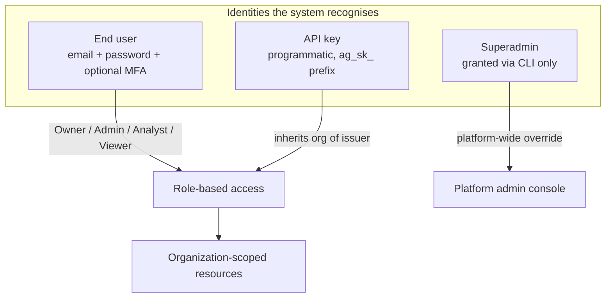
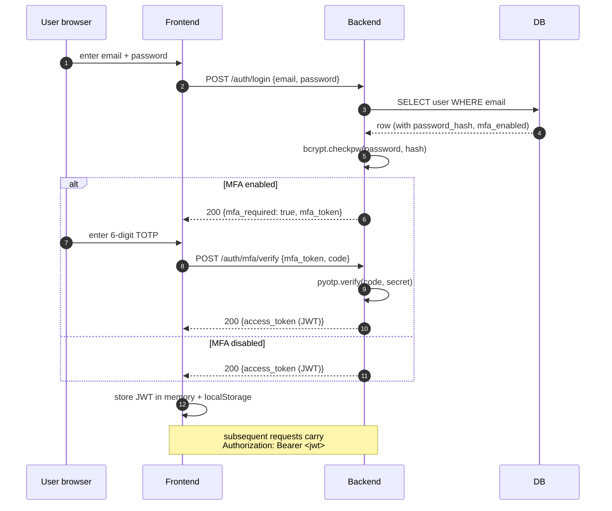
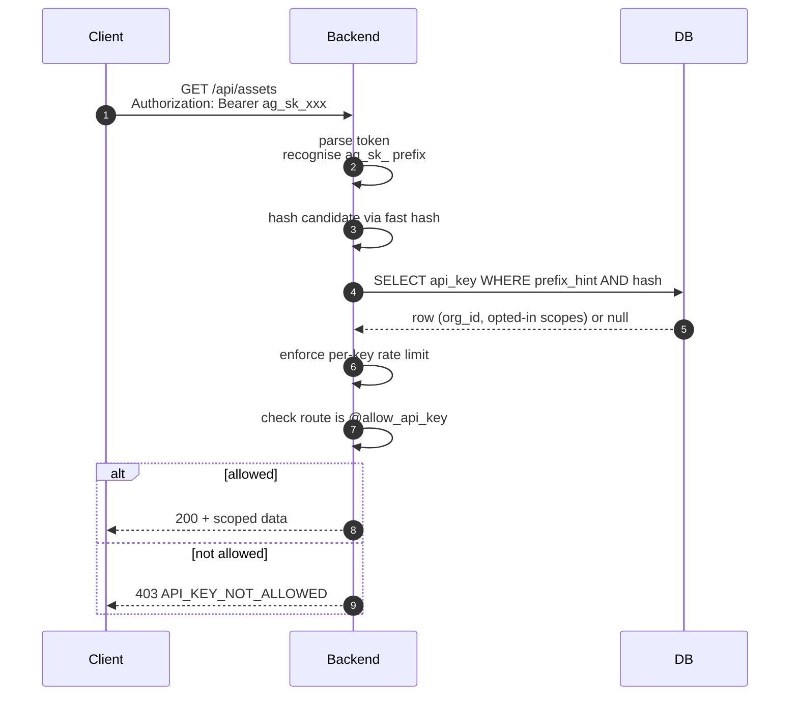

# SAD View 06 — Security Architecture

| Field | Value |
|---|---|
| Parent document | `03-sad.md` |
| View ID | 06 — Security |
| Status | Draft |
| Last reviewed | 2026-05-05 |

The security view describes how identity, authorisation, secrets, and sensitive flows are implemented in Nano EASM. It is the architectural counterpart to the SRS Module 02 (Auth) and the forthcoming **04 Threat Model** document.

---

## 1. Identity model

| Identity | Authenticates with | Used by | Scope |
|---|---|---|---|
| End user | Email + password (+ optional TOTP) → JWT | Web app | Their organization, role-bounded |
| API key | `ag_sk_<rest>` via `Authorization: Bearer` or `X-API-Key` | External scripts, CI, customer integrations | Issuer's organization, opted-in routes only |
| Superadmin | Same email/password as end user, **plus** `is_superadmin=True` row in DB (set via CLI) | Platform admin console at `/admin/*` | Cross-tenant; bypass RBAC |

There is no concept of a service account separate from API keys, and no SSO / SAML / OIDC today. SSO is deferred to a future tier (SRS Module 02 has it as a P2 gap).

---

## 2. Web app authentication flow

**Token storage trade-off:** JWT in `localStorage` (not `HttpOnly` cookies). The trade was deliberate (ADR 0005):

| Storage | XSS risk | CSRF risk | Cross-origin support |
|---|---|---|---|
| `HttpOnly` cookie | Lower (script can't read) | Higher (need CSRF tokens) | Awkward |
| `localStorage` (chosen) | Higher (a successful XSS reads the token) | None (no auto-attached cookie) | Trivial |

We chose `localStorage` because **(a)** our XSS posture is strong (CSP, input sanitisation, framework-level escaping in React), **(b)** we eliminate CSRF entirely as a class of bug, and **(c)** the API-key transport is already `Authorization` header — using the same header for web JWTs makes the API surface symmetric.

---

## 3. JWT specifics

- Algorithm: **HS256** (symmetric). Secret in `SECRET_KEY` env var.
- Claims: `sub` (user id), `org_id`, `role`, `iat`, `exp`, `jti` (token id).
- Lifetime: **30 minutes**. Refreshed via a sliding-window inactivity gate (NFR-SEC-005, NFR-SEC-006).
- No refresh token. The frontend silently re-authenticates by extending the session if user activity is detected within the inactivity window. Idle past the window → redirect to login.
- Revocation: **stateless**. There is no JWT denylist today (gap — flagged in `00-positioning-pivot-tasks.md` §10.2). Compromise mitigation today is "rotate `SECRET_KEY`," which invalidates **every** token at once.

The lack of a per-user revocation list is a known gap. The threat model treats it as accepted given short token lifetime; future work moves to a Redis-backed `jti` denylist.

---

## 4. Password storage

- **bcrypt** with default cost factor 12.
- Password complexity rules per FR-AUTH and NFR-SEC-002. Minimum length 12, blocked list of common passwords, no maximum length cap.
- Reset flow: token-based, single-use, 1-hour expiry. Reset tokens are signed (HMAC, distinct secret from JWT signing — `RESET_TOKEN_SECRET`).
- **Email verification on signup** is required before login is allowed. The verification link contains a signed token; the page does **not** auto-fire the verify call (regression fix — email scanners pre-fetch URLs and were consuming tokens). User clicks "Verify my email," which POSTs the token.

---

## 5. MFA (TOTP) — spec, not yet implemented

Specified in SRS FR-AUTH-012 → FR-AUTH-017. Tracked as a gap in `00-positioning-pivot-tasks.md` §10.1 (10 implementation subtasks). Architectural shape, when delivered:

- **TOTP** (RFC 6238) — 30-second windows, 6 digits, SHA-1 (compatibility), 1-step grace.
- Secret stored on `user.mfa_secret` column, encrypted with a key in env (`MFA_SECRET_KEY`). The encryption-at-rest gap (§05 Data §12) lands here as the first concrete column needing app-layer encryption.
- 10 single-use **recovery codes** generated at enrolment, hashed (bcrypt) and stored in `user_recovery_code` table.
- Required for `is_superadmin` users (login fails if not enabled) and **strongly encouraged** for Owner / Admin roles. Analysts / Viewers may opt in.
- Login flow becomes two-step: password → MFA challenge → JWT issuance, as in §2 above.

---

## 6. API key authentication

**Storage:** plaintext shown **once** at creation. Stored as a salted hash. The leading `ag_sk_<short-prefix>` (first 8 chars) is stored alongside for display and prefix lookup; the full token is irrecoverable from the DB.

**Default-deny:** routes are inaccessible to API keys unless decorated with `@allow_api_key` (FR-API-004). Billing, member management, settings of significance, and all `/admin/*` are explicitly never decorated.

**Rate limiting:** per FR-API-005. Read 600/h, write 60/h per key. Currently relies on per-route Flask-Limiter defaults rather than per-key counters — flagged as PARTIAL.

---

## 7. RBAC role matrix

| Role | Read | Scan kickoff | Manage assets | Manage members | Manage billing | Manage settings | Audit log read |
|---|:---:|:---:|:---:|:---:|:---:|:---:|:---:|
| Viewer | ✓ | – | – | – | – | – | – |
| Analyst | ✓ | ✓ | ✓ | – | – | – | own actions |
| Admin | ✓ | ✓ | ✓ | ✓ | – | ✓ | full org |
| Owner | ✓ | ✓ | ✓ | ✓ | ✓ | ✓ | full org |

Implemented in `app/auth/permissions.py`. The decorator approach `@require_role("Admin")` checks `g.user.role`. Role hierarchy is linear; an Admin implicitly has Analyst rights, etc.

**Plan-based limits** are a separate axis from RBAC. `@check_limit("scans_per_month")` is independent of `@require_role(...)`. Both must pass.

---

## 8. Tenant scoping

Discussed in §05-data-architecture §3. From the security perspective:

- The risk we are guarding against is **horizontal privilege escalation** — user A reading user B's data when both are in different orgs.
- The defence is **query-time filtering**, applied uniformly. Code review treats unscoped queries as a high-priority finding.
- The audit log surface area for tenant isolation drift is small because every tenant-scoped table has its own `organization_id` (denormalised on purpose).

Vertical privilege escalation (Viewer becoming Admin) is guarded by RBAC decorators; the test suite covers each route with each role.

---

## 9. Secrets handling

| Secret | Where | Read by |
|---|---|---|
| `SECRET_KEY` (JWT signing) | Host `.env` | Backend container |
| `RESET_TOKEN_SECRET` | Host `.env` | Backend container |
| `STRIPE_API_KEY`, `STRIPE_WEBHOOK_SECRET` | Host `.env` | Backend |
| `RESEND_API_KEY` | Host `.env` | Backend |
| `SHODAN_API_KEY`, `VIRUSTOTAL_API_KEY`, `ABUSEIPDB_API_KEY` | Host `.env` | Backend |
| Postgres password | Host `.env` | Backend, Postgres init |
| `MFA_SECRET_KEY` (planned) | Host `.env` | Backend |
| API key hashes | DB | Backend (via SQLAlchemy) |
| User password hashes | DB | Backend |

The `.env` file lives on the EC2 host at `~/boltedge-easm/.env`, mode `600`, owned by deploy user. Secret Manager / SSM is in the scaling-path roadmap (§04 Deployment §10) but not yet adopted — a known gap that becomes pressing the moment we add a second host or a second engineer.

**Secrets in transit:** outbound calls to third-party APIs always use TLS. Internal container ↔ container traffic on the host bridge is plaintext, which we accept (single host, no network surface).

---

## 10. Input validation and output encoding

- **Validation at the boundary.** Routes validate request bodies via Pydantic / Marshmallow schemas (`schemas.py` per blueprint). Internal calls trust the validated shape.
- **Output encoding** is React's default behaviour — every interpolated string is HTML-escaped unless explicitly opted out via `dangerouslySetInnerHTML`. We do not use that anywhere user data flows into.
- **SQL injection** is prevented by SQLAlchemy parametrisation. Raw SQL appears in two places — schema migrations and one analytics query — and is reviewed to confirm parameters are bound, not interpolated.
- **Command injection** is not a surface today; the backend does not exec shell commands derived from user input. Scanner engines that wrap external binaries (e.g. nuclei) pass arguments via `subprocess` arg lists, never `shell=True`.

---

## 11. CORS and CSRF posture

- CORS allows only the configured frontend origin(s) — `https://nanoeasm.com`, plus `http://localhost:3000` in development. Wildcard origin is rejected (FR-API-009).
- **No CSRF tokens needed** because JWT lives in `Authorization` header, not a cookie. There is no auto-attached credential a malicious site could leverage.
- The few cookies we do set (`asm_*` localStorage shadows are *not* cookies; only Stripe Checkout sets cookies on its own domain) carry no auth state.

---

## 12. Brute-force and abuse protections

| Vector | Defence |
|---|---|
| Login brute-force | Per-IP rate limit (Flask-Limiter); per-email rate limit; account lockout after N failures (gap — flagged in pivot tasks) |
| API key brute-force | Per-IP rate limit; revoked key returns 401 immediately (no oracle) |
| Quick-scan abuse (anonymous) | Per-IP 5 scans / hour, logged in `quick_scan_log`, blockable by superadmin |
| Registration abuse | reCAPTCHA, per-IP throttle, email verification required before login |
| Outbound webhook abuse-by-customer (SSRF style) | Customer-supplied audit webhook URLs are POSTed to as-given; they cannot reach internal services because the EC2 instance has no internal-only network. Future scaling step (private network) will require an SSRF guard list |

Account lockout / progressive delay is a known gap (§10.2 of pivot tasks); today the rate limiter is the primary defence and is sufficient for the threat model at current scale.

---

## 13. Audit logging

Every privilege-relevant action writes one row to `audit_log` (§05 Data §3.4 / §9.3). Categories include `auth`, `member`, `asset`, `scan`, `finding`, `monitor`, `billing`, `settings`, `admin`, `api_key`, `report`. The full list lives in `app/audit/categories.py`.

Audit log is **append-only**. There is no edit endpoint and no delete endpoint other than the per-tier retention purge.

The optional **audit-webhook stream** (CLAUDE.md "Audit Log Webhook Stream") forwards every row to a customer-configured HTTPS endpoint with HMAC-SHA256 signing and a per-event UUID for idempotency. Failures are recorded in `audit_webhook_delivery` but never block the user action.

---

## 14. Email security

- Outbound transactional email goes through Resend. SPF, DKIM, DMARC are configured on `nanoeasm.com`.
- Verification, password-reset, MFA-enrolment, and trial-approval emails carry signed tokens; the **link does not auto-fire any state change** — the landing page requires a user click before POSTing the token. This is the regression fix for the email-scanner pre-fetch issue and applies uniformly to every transactional email.
- We do not put one-time passwords in email subject lines (display preview risk).

---

## 15. Superadmin model

- Granted only via Flask CLI (`flask grant-superadmin <email>`). No UI.
- The `/admin/*` routes return **404** (not 401/403) to non-superadmins — the route appears not to exist (NFR-SEC-013).
- `require_superadmin` decorator **re-fetches the user from the DB** on every request — JWT-only trust is not enough. A revoked superadmin loses access on the next request, not at the next token expiry.
- All admin actions are audit-logged with `organization_id=NULL` (platform-level) and `actor_user_id` set.
- **Impersonation** is supported (admin acts as a tenant user). Impersonation issues a normal session token for the target user; the admin session is preserved client-side in `localStorage` so the admin can return. Both the impersonate and the exit are audit-logged.

---

## 16. Threat model snapshot

A standalone **04 Threat Model** document covers this in depth. The high-level threats and the SAD's response:

| Threat | Architectural mitigation |
|---|---|
| Cross-tenant data leak | Defence-in-depth tenant scoping (§8) |
| JWT theft via XSS | CSP, framework escaping, short token lifetime, MFA for elevated roles |
| API key leak | Hashed at rest, default-deny scopes, rate-limited, revocable |
| Credential stuffing | Rate limit + email verification + (planned) MFA + (gap) account lockout |
| SSRF via customer-supplied webhook URL | Single-host network has no internal-only services to reach; revisit at scale step |
| Stripe webhook spoofing | Signature verification + per-event idempotency table |
| Supply chain (npm / pip) | Pinned dependencies, quarterly upgrade window, no auto-updates |
| Lost laptop with `.env` | Secrets are server-side; engineer laptops do not hold production secrets |

---

## 17. What security view does not show

- The full data model and tenant scoping mechanics → §05-data-architecture
- Process model and graceful degradation → §02-runtime-view
- Deployment-time secrets handling → §04-deployment-view §4
- Detailed threat model and STRIDE breakdown → **04 Threat Model** (separate doc)
- Test plan for security-relevant invariants → **06 Test Strategy** (separate doc)
- Compliance posture and customer-facing claims → SRS §6, **05 Security Policy**, **10 DPA**

---

*End of view 06 — Security architecture.*
