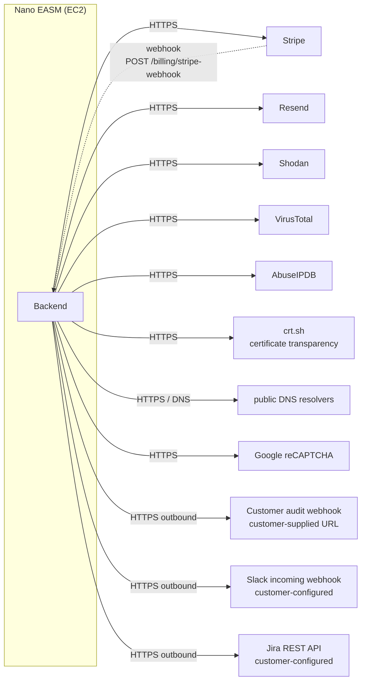
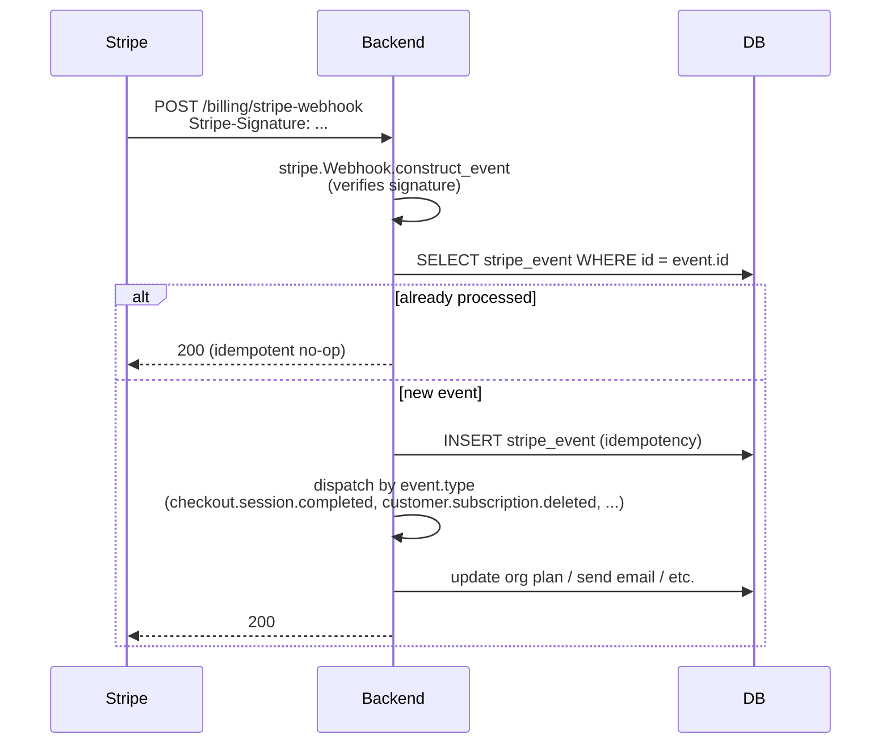

# SAD View 07 — External Integrations

| Field | Value |
|---|---|
| Parent document | `03-sad.md` |
| View ID | 07 — External integrations |
| Status | Draft |
| Last reviewed | 2026-05-05 |

This view catalogues every external service Nano EASM talks to, what it is used for, the trust boundary, the failure mode, and the integration code path. It is the "what would happen if vendor X went down for an hour" reference.

---

## 1. Integration catalogue

| Service | Direction | Trust tier | Required for | Failure mode |
|---|---|---|---|---|
| Stripe | bi-directional | Critical (revenue) | Billing checkout, subscription, webhooks | Customer-facing billing flow blocks; existing access unaffected |
| Resend | outbound | Important (UX) | Transactional email | Queued, retried |
| Shodan | outbound | Important (scan quality) | Service / port enrichment | Scanner skips Shodan analyzers, returns partial results |
| VirusTotal | outbound | Optional | IP / domain reputation enrichment | Skipped silently |
| AbuseIPDB | outbound | Optional | IP reputation enrichment | Skipped silently |
| crt.sh | outbound | Important (discovery) | Certificate-transparency-based subdomain discovery | Discovery module returns partial result |
| Public DNS resolvers | outbound | Important (discovery) | DNS enumeration | Discovery module returns partial result |
| Google reCAPTCHA | outbound | Important (abuse) | Public quick-scan, registration | Hard fail (we don't accept anonymous traffic without bot defence) |
| Customer audit webhook | outbound | Customer-controlled | Audit log streaming to SIEM | Logged failure, no user-action rollback |
| Slack incoming webhook | outbound | Customer-controlled | Notifications | Logged failure |
| Jira REST API | outbound | Customer-controlled | Finding → ticket sync | Logged failure |

The pattern: **first-party integrations** (Stripe, Resend, Shodan) are configured by us in env vars. **Customer-controlled integrations** (Slack, Jira, audit webhook) are configured per-org in the settings UI; their failures are visible to the customer who owns them, not to us.

---

## 2. Stripe

### 2.1 Use

Subscription billing. Hosted Checkout for upgrade flows. Customer Portal for self-service plan management. Webhook for subscription lifecycle events.

### 2.2 Code paths

| File | Role |
|---|---|
| `app/billing/stripe_service.py` | Wrapper around `stripe-python`; product/price id env-var resolution |
| `app/billing/routes.py` | `/billing/checkout`, `/billing/portal`, `/billing/upgrade`, `/billing/stripe-webhook` |
| `app/billing/emails.py` | Receipt, payment-failed, refund emails sent from our domain via Resend (not Stripe defaults) |

### 2.3 Webhook handling

**Idempotency:** every event id is inserted into `stripe_event` table on first receipt. Duplicate deliveries (Stripe retries) are no-ops.

**Signature verification** is mandatory. The webhook secret is in `STRIPE_WEBHOOK_SECRET`. A request that fails verification returns 400 and is **not** logged with body content (treated as adversarial).

### 2.4 Currency and prices

AUD-denominated Prices live in the Stripe dashboard. Their `price_…` IDs are pasted into env vars (`STRIPE_PRICE_STARTER_MONTHLY`, `STRIPE_PRICE_STARTER_ANNUAL`, etc.). Switching currency = creating new Prices in Stripe and pointing the env vars at them. The code never hard-codes price ids.

### 2.5 Failure mode

| Failure | Impact | Recovery |
|---|---|---|
| Stripe API down | Checkout returns 503; existing customers unaffected (their plan state lives in our DB) | Retry on user click |
| Webhook missed | Subscription state can drift | Stripe retries up to 3 days; reconciliation job (planned) catches drift |
| Webhook signature mismatch | Suspect adversarial; rejected | None — drop |

### 2.6 Test mode vs live mode

`STRIPE_API_KEY` carries the mode (`sk_test_` / `sk_live_`). Local dev uses test mode. Production uses live. There is no toggle in code — the key is the source of truth.

---

## 3. Resend

### 3.1 Use

All outbound transactional email: signup verification, password reset, MFA enrolment, trial approved, plan changes, finding alerts (when configured), invoices.

### 3.2 Code paths

`app/billing/emails.py` defines individual email functions (`send_verification_email`, `send_trial_approved_email`, etc.). Each builds the HTML + text body from a template and posts to Resend.

### 3.3 Send model

The send is **synchronous** within the request handler today. If Resend is slow, the user sees a slow request. Mitigations:

- 10-second timeout on the Resend call.
- On exception, the email is **enqueued** in `outbound_email` table (`status=pending`) and a daily retry job picks it up. The user's action (signup, password change) is **not** rolled back — the email is best-effort.
- For high-volume flows (finding alerts), the entire send loop runs in the scheduler thread, never on a request thread.

### 3.4 Anti-pre-fetch design

Every transactional email contains a link to a landing page that **does not auto-fire any state change**. The landing page requires a user click before POSTing the token. This protects against email security scanners that pre-fetch URLs and would otherwise consume single-use tokens. Applied uniformly: verify-email, password-reset, MFA enrolment, etc.

### 3.5 Domain authentication

`nanoasm.com` is configured in Resend with SPF, DKIM, DMARC. Outbound mail from any other origin (including Stripe defaults) is suppressed — receipt and refund emails are sent by us via Resend, not by Stripe directly, so the domain is consistent.

---

## 4. Shodan

### 4.1 Use

Service banner data, open ports, certificate metadata, organisation attribution. Used by the scanner orchestrator to enrich asset records before passing them to vulnerability analyzers.

### 4.2 Code paths

`app/services/shodan_client.py` wraps the Shodan API. Functions: `host_info(ip)`, `search(query)`, `dns_resolve(domains)`. Each function:

1. Checks `SHODAN_API_KEY` is set; if not, returns `None` and logs at INFO ("shodan disabled").
2. Calls Shodan with a 10-second timeout.
3. On non-200 or timeout, raises a `ShodanUnavailable` exception which the scanner orchestrator catches.

### 4.3 Cost discipline

Shodan calls cost credits. The scanner orchestrator caches per-asset enrichment in `asset.metadata["shodan"]` with a TTL of 24 hours. Re-scans within the TTL window do not re-query Shodan unless the user explicitly opts in.

The plan-tier cost rationale (CLAUDE.md "Per-scan marginal costs") assumes specific Shodan call counts per scan kind. Changing those counts changes margin — see CLAUDE.md hard rule #6.

### 4.4 Failure mode

Scanner skips Shodan-dependent analyzers, logs `service_unavailable`, returns partial results. The scan job's `result_summary` includes `partial: true` and a list of skipped analyzers; the UI surfaces this as a yellow warning ribbon on the scan detail page.

---

## 5. VirusTotal and AbuseIPDB (optional enrichment)

Both are **optional**. The pattern is identical:

- Env-var-keyed (`VIRUSTOTAL_API_KEY`, `ABUSEIPDB_API_KEY`).
- Wrapped in `app/services/`.
- If the key is unset, the analyzer is skipped silently. No warning on the scan result.
- If the key is set but the call fails, the analyzer is skipped with a debug log line. No warning surfaced.

These services exist to *enhance* findings, not to *produce* them. A scan with neither configured runs to completion with no degradation visible to the user.

---

## 6. Discovery sources (CT, DNS)

### 6.1 crt.sh

The discovery `ct_logs` module queries `crt.sh` via the JSON API for certificates issued for a root domain. From those, subdomains are extracted. crt.sh is occasionally slow or rate-limits; the module has a 30-second timeout and a single retry, then gives up and returns whatever it found.

### 6.2 DNS resolvers

The discovery `dns_enum` module uses public DNS (Cloudflare 1.1.1.1, Google 8.8.8.8) for A/AAAA/MX/NS/TXT lookups during brute-force enumeration. Wildcard detection is performed first to avoid enumerating a wildcard zone into oblivion.

### 6.3 Failure mode

Either source down → that module returns a partial list; the discovery orchestrator merges what it has from the other modules. The user sees an "incomplete sources" note on the discovery job summary.

---

## 7. Google reCAPTCHA

### 7.1 Use

Public surfaces only:
- Registration page
- Public quick-scan page (`/quick-scan`)

Both are anonymous, both are abuse magnets.

### 7.2 Mode

reCAPTCHA v3 (score-based). The frontend obtains a token; the backend verifies via Google's siteverify API. Score threshold default 0.5; tunable via env.

### 7.3 Failure mode

If Google's siteverify is unreachable, the public endpoint **fails closed** — returns 503 with a "verification unavailable" message. Anonymous traffic without bot defence is not a tradeoff we accept; better to bounce a real user than to admit a flood.

Authenticated flows do not use reCAPTCHA, so logged-in users are unaffected.

---

## 8. Customer-controlled outbound integrations

These are configured per-org in the settings UI. The customer owns the configuration; failures are surfaced to them, not to us.

### 8.1 Audit log webhook

Per CLAUDE.md "Audit Log Webhook Stream" — covered in detail in §05-data-architecture §9.3 and §06-security-architecture §13. Plan-gated to Enterprise Gold + Custom.

- Customer supplies URL.
- We generate the secret server-side (`secrets.token_urlsafe(32)`).
- HMAC-SHA256 signature in `X-Nano-Signature`.
- Per-event UUID in `X-Nano-Event-Id` for idempotency on the receiver.
- 10-second timeout, no retries today, every attempt recorded in `audit_webhook_delivery`.

### 8.2 Slack incoming webhook

Customer pastes a Slack incoming-webhook URL. Notifications (new critical findings, monitor alerts) POST a JSON payload. No signing — Slack incoming webhooks rely on URL secrecy. We treat the webhook URL as a secret (mask in UI after first save).

### 8.3 Jira

Customer provides Jira base URL, email, API token. We call Jira's REST API to create issues from findings. Token stored encrypted (planned — currently hashed; see §05 Data §12 for the encryption gap). Each integration test sends a no-op call to validate credentials.

### 8.4 Trust boundary

These are **outbound-only**, customer-configured. The customer controls the destination URL / credentials. Failures are recorded but **never** roll back the originating user action.

The SSRF concern (customer points the audit webhook at `http://169.254.169.254/...`) is theoretical today because the EC2 instance has no internal-only services to leak. When we add a private network (scaling step §04 Deployment §10), an SSRF guard list becomes mandatory before we onboard the customer onto the new topology.

---

## 9. Common patterns across all integrations

### 9.1 Client structure (`app/services/<vendor>_client.py`)

- Module-level `_client_or_none()` returns the configured client or `None` if the key is missing.
- Every public function checks for `None` and either raises a domain exception or returns a sentinel.
- Timeouts are explicit on every call, never default.
- Errors are logged at WARN; exceptions raised are captured per-vendor exception types.

### 9.2 Retry policy

- Read calls (Shodan, VirusTotal): single retry on 429 / 5xx with 1s backoff. Beyond that, give up.
- Write calls (Stripe checkout, Resend send, customer webhooks): **no automatic retry** within the request — the user retries by clicking again.
- Webhook receipt (Stripe → us): the sender retries; we are idempotent.
- Email send: failure enqueues to `outbound_email`; daily job retries up to 3 times before flagging the row `status=permanently_failed`.

### 9.3 Circuit breakers

We don't have a formal circuit breaker library today. A simple per-vendor in-memory counter ("3 failures in 60s → trip for 5 min, return cached/sentinel") is implemented for Shodan and crt.sh in their client modules. Other vendors don't yet have it.

### 9.4 Mocking in tests

Each `app/services/<vendor>_client.py` is mockable at the module boundary. Integration tests use `pytest`'s monkeypatch to swap `_client_or_none()` with a fake. We do not run live calls to third parties in CI.

---

## 10. Vendor inventory and contractual posture

| Vendor | Plan | Cost driver | Replacement difficulty |
|---|---|---|---|
| Stripe | Standard | % of revenue | Hard — would require porting to a different payment processor |
| Resend | Per-email | Volume | Easy — abstraction is thin (`emails.py`); could swap to Postmark / SES with a few hundred lines of work |
| Shodan | Corporate | Per-credit | Medium — would lose enrichment quality; replaceable with Censys or self-hosted scanning |
| VirusTotal | Public/Premium | Per-call | Easy — optional enrichment, can be removed |
| AbuseIPDB | Free | Per-call | Easy — optional enrichment |
| reCAPTCHA | v3 free tier | – | Easy — could swap to hCaptcha or Cloudflare Turnstile |
| crt.sh | Public | – | Medium — would lose CT-based discovery; alternatives exist (Censys CT) |
| Public DNS | – | – | N/A |

The replacement-difficulty column matters: it tells us which vendors deserve abstraction layers (we have them for Stripe, Resend, Shodan) and which don't (reCAPTCHA, crt.sh, DNS).

---

## 11. What integrations view does not show

- Where these are deployed and what env vars carry the keys → §04-deployment-view §4
- Failure handling at the runtime / request level → §02-runtime-view §8
- Data shape stored from each integration → §05-data-architecture
- Auth flows around Stripe Customer Portal handoff → §06-security-architecture
- Observability / alerting on integration health → §08-observability

---

*End of view 07 — External integrations.*
