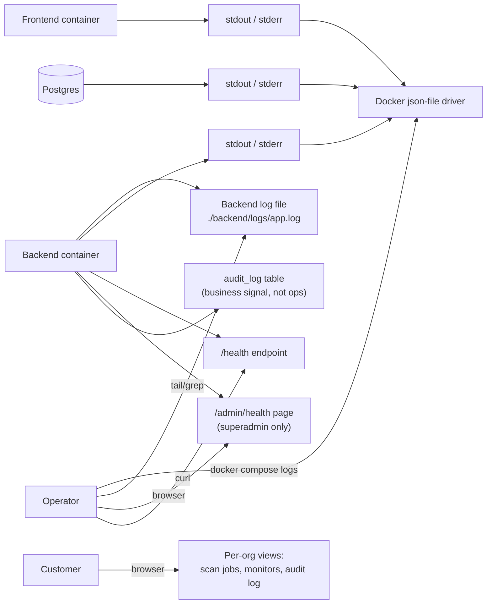

# SAD View 08 — Observability

| Field | Value |
|---|---|
| Parent document | `03-sad.md` |
| View ID | 08 — Observability |
| Status | Draft |
| Last reviewed | 2026-05-05 |

The observability view describes how we know what the system is doing, where it broke, and how customers and operators learn that something needs attention. The current posture is **light**: we log, we expose health, and we surface platform-wide signals via the admin console. External APM / metrics / log aggregation is on the scaling-path roadmap, not in place today.

This view is honest about the gap between where we are and where we need to be when revenue and customer count grow.

---

## 1. Observability surfaces

The picture is intentional: there is **no external sink** today (no Sentry, no CloudWatch shipper, no Loki / Better Stack). Logs and health live on the host; the operator pulls them via SSH. This is acceptable at single-host scale; it will not be acceptable at fleet scale.

---

## 2. Logging

### 2.1 Backend logging

- Python's `logging` module, configured in `app/__init__.py`.
- Handlers:
  - `StreamHandler` to stdout/stderr (captured by Docker).
  - `RotatingFileHandler` to `/app/logs/app.log` inside the container, mounted to `./backend/logs` on the host. Rotation: 100 MB × 5 files.
- Format: structured-ish — `%(asctime)s [%(levelname)s] %(name)s :: %(message)s`. JSON logging is on the roadmap; not done.

### 2.2 Levels and what we use them for

| Level | Used for |
|---|---|
| `DEBUG` | Verbose dev signal; off in production (`LOG_LEVEL=INFO`) |
| `INFO` | Normal operations: request completed, scheduled job ran, scan finished |
| `WARN` | Recoverable degradation: external API timeout retried, optional enrichment skipped, slow query, rate limit hit |
| `ERROR` | Action failed in a way that affected a user or a job: scan crashed, webhook 500'd permanently, email-send permanent failure |
| `CRITICAL` | System-level: scheduler thread crashed, DB connection lost, can't bind port |

The cardinality discipline: **don't ERROR on a Shodan blip.** WARN with a reason; let the operator search for sustained patterns. ERROR is for things a human probably needs to look at.

### 2.3 Stack traces

Every uncaught exception inside a request handler logs the full stack via `current_app.logger.exception(...)`. The response to the client is the sanitised JSON shape (`{ "error": "...", "code": "INTERNAL_ERROR" }`); the trace stays in the log only.

### 2.4 Frontend logging

- Browser `console.error` for client-side errors.
- The Next.js server logs to stdout for SSR errors.
- No client-side error reporting service today (Sentry, Bugsnag, etc.). Customers reporting issues describe them; we reproduce locally. **Gap** for any meaningful scale.

### 2.5 Log retention

- On-host: 100 MB × 5 files = ~500 MB. Past that, the rotation drops the oldest.
- Off-host: nothing. If the EC2 instance dies, logs older than the daily backup snapshot are gone.
- This is the single largest observability gap. Externalising logs to CloudWatch or a hosted aggregator is the **first** observability step on the scaling path (§7).

---

## 3. Audit log vs application log

These are **separate concerns** and should not be conflated:

| | Application log | Audit log |
|---|---|---|
| Purpose | "What did the code do? Where did it break?" | "What did a privileged identity do?" |
| Audience | Operators / engineers | Customers, their auditors, our compliance posture |
| Persistence | File on host, rotated in days | Postgres, retained per-tier (90d / 1y / 7y) |
| Mutability | Operator can `rm` the files | Append-only; purge only by policy |
| Forwardable | No (today) | Yes, to customer SIEM via audit-webhook stream |

Application logs are an **operations** tool. Audit logs are a **business** record. They cover overlapping events but for different reasons; the audit log is canonical for "did the user do X" and the app log is canonical for "did the code crash on Y."

---

## 4. Health endpoints

### 4.1 `/health` (unauthenticated)

`GET /api/health` returns `{ "status": "ok" }` if:
- The Flask app is up.
- A `SELECT 1` to Postgres succeeds within 2 seconds.

Used by:
- Nginx upstream health check (every few seconds).
- The platform admin **Health** page.
- External uptime monitoring (e.g. UptimeRobot — configured externally; not part of the deployment).

### 4.2 `/admin/health` (superadmin)

The platform admin Health page (`/admin/health`) exposes:
- DB ping latency + connection pool stats.
- Scheduler tick freshness (last successful run per job).
- Scan job queue depth (count by status).
- Recent error count (24 h, by category).
- Uptime since last container restart.
- Platform-wide totals: orgs, users, assets, scans.

This page is the **operator's single console** for "is the system healthy right now?" Without external metrics, this view is the closest thing we have to a dashboard.

---

## 5. Metrics

### 5.1 What we measure today

We do not currently emit metrics in the structured-time-series sense (Prometheus / StatsD / OpenTelemetry). What approximates a metric set lives in two places:

| Source | What it tells you | How you read it |
|---|---|---|
| `/admin/health` page | Current point-in-time state | Browse the page |
| Per-org dashboard | Per-customer state | Customer's UI |
| `audit_log` aggregate queries | Action rate by category | Ad-hoc SQL |

There is no graph of CPU, memory, request latency, error rate, scan throughput, or queue depth over time. The host's CloudWatch metrics are available but not surfaced.

### 5.2 What we'd want next

The first metrics worth wiring, in order of value:

1. **Request latency p50 / p95 / p99 by route** — catches slow regressions.
2. **Error rate by route** — leading indicator of regressions before users complain.
3. **Scan job throughput + duration** — directly tied to capacity planning.
4. **External vendor latency + error rate** — Shodan, Stripe, Resend.
5. **Scheduler tick latency** — how late is the scheduler vs schedule.
6. **DB connection pool saturation** — leading indicator of timeouts.

The expected wiring is OpenTelemetry + a hosted backend (Honeycomb, Grafana Cloud, or AWS Managed Prometheus + Grafana). Not done; tracked in §7 below.

---

## 6. Tracing

No distributed tracing today. Single backend process, single thread of execution per request — adding tracing now would buy little. When we split scans onto worker hosts (§04 Deployment §10 step 5), tracing becomes mandatory because a "scan request" will span request thread → queue → worker thread → DB. Until then, log-correlation by `request_id` is sufficient.

A request id is generated in a `before_request` hook and attached to `g.request_id`; every log line within that request includes the id. A future tracing system can use this as the trace id.

---

## 7. Alerting

### 7.1 What pages a human today

Almost nothing automatic.
- The host has an **EC2 status check alarm** in CloudWatch — fires if the instance becomes unreachable.
- An **external uptime monitor** (UptimeRobot) hits `https://nanoeasm.com/api/health` every few minutes and alerts via email if down.
- Stripe sends emails on payment failures.
- Resend sends emails on DKIM / DMARC misconfiguration.

That's it. No alerting on application errors, scan failures, scheduler stalls, or DB latency.

### 7.2 What we accept

The threshold for accepting "no alerting" is small customer count + operator awake during business hours + outage tolerance > 1 hour. As soon as those change — paid Enterprise customers signing SLAs, off-hours support obligation, or contractual uptime targets — we need real alerting.

### 7.3 Roadmap

In order:

1. Ship logs to a hosted aggregator (CloudWatch Logs, Better Stack, Loki) — gets us search and retention for free.
2. Wire **Sentry** for backend exceptions — captures every uncaught error with stack and context, deduplicates, alerts on regression.
3. Wire **Sentry** (or equivalent) for the frontend — catches client-side errors customers won't report.
4. Add OpenTelemetry to the backend, ship metrics + traces to a hosted backend.
5. Define alert policies: error rate > X for 5 min, scan failures > Y per hour, scheduler tick lag > Z, DB pool saturation > 80%.
6. Route alerts to PagerDuty / Slack with severity tiers.

Each step is independently valuable; we don't need to do them all before we get value.

---

## 8. Customer-facing observability

What the customer can see about their own activity:

| Surface | What it shows |
|---|---|
| Dashboard | Asset count, recent scans, open findings, plan usage |
| Scan jobs page | Per-job status, duration, finding count, errors |
| Audit log page | Their own org's audit trail (filterable, exportable) |
| Audit-webhook stream | Their own events forwarded to their SIEM (Enterprise Gold / Custom) |
| Notification settings | Slack / email alerts the customer configured for finding events |

This is "observability for their data and their actions." It is independent of our operational observability and is fully implemented.

---

## 9. Privacy in logs

- Application logs **must not** contain passwords, MFA codes, JWT tokens, API key plaintext, or webhook secrets. The redaction is at log-call site, not in a log post-processor — a missed redaction is a bug, not an aggregation issue.
- Email addresses **may** appear in logs (for "user X did Y"). The audit log is the canonical place; app logs follow suit when the action is being investigated.
- IP addresses appear in rate-limit logs and quick-scan logs.
- PII in scan results (subdomains that themselves carry employee names, etc.) is **customer data**, not log data — we don't write it to app logs.

A periodic grep over the log files for `password=`, `Bearer`, `ag_sk_`, `whsec_` patterns is part of the manual review (no automation today).

---

## 10. Diagnostic operator workflows

### 10.1 "A user reports their scan failed"

1. Get the scan job display id from the user (`SC0123`).
2. SSH to host, `docker compose logs easm-backend | grep SC0123` (or by request id, or by the integer pk).
3. Inspect the scan job row + child rows in DB if needed.
4. Check `/admin/health` for system-wide signal.
5. If the cause is a vendor outage, confirm via vendor's status page; if internal, file a fix.

### 10.2 "Latency seems slow"

1. `/admin/health` — DB ping, pool stats, queue depth.
2. `docker compose top` — CPU / memory of each container.
3. EC2 CloudWatch metrics for host-level CPU, network, disk.
4. If consistently slow, escalate to the scaling-path step that addresses the bottleneck.

### 10.3 "A scan is stuck running"

1. Check `scan_job` row — `status`, `last_heartbeat_at`.
2. If `last_heartbeat_at` is fresh, it's actually running; let it finish.
3. If stale, the reconciliation pass on next backend boot will mark it failed (§02 Runtime §10). Restart the backend container if the user is blocked.

These workflows exist as institutional knowledge today; they live in the team's heads and the SAD. A runbook document will codify them as the team grows beyond one operator.

---

## 11. Incident review

Today: ad-hoc. No formal post-mortem template, no incident tracker. As contractual SLAs land, an incident process becomes necessary; it will live in **05 Security Policy** / operational runbook documents.

The minimum disciplines we keep even at our current size:
- Every customer-affecting outage is captured in a chat thread with start time, end time, root cause, fix.
- Every fix is tested and merged through normal PR review (no "hot patch on the host" without follow-up commit).
- Lessons learned that change architecture become ADRs. Lessons learned that change behaviour become test cases.

---

## 12. Observability budget

The scaling-path roadmap (§7.3) implies cost. Today we spend ~zero dollars on observability tooling. A reasonable budget when we're ready:

- Sentry: **$26 / mo** starter, scales with event volume.
- Better Stack / Logtail: **$25 / mo** starter for log retention.
- Grafana Cloud free tier covers our metrics + traces volume for some time.

Total ~$50–100 / mo is reasonable as a first observability spend, gated on having paying customers above the free tier. Not a blocker, but worth budgeting for so it doesn't surprise us.

---

## 13. What observability view does not show

- The runtime model that produces the signals → §02-runtime-view
- Where logs are written and what they cost on disk → §04-deployment-view §9
- The schema of `audit_log` and retention → §05-data-architecture §3.4, §8
- Vendor-specific failure handling → §07-external-integrations
- Backup and DR runbook → **08 Backup & DR** (separate doc)

---

*End of view 08 — Observability.*
