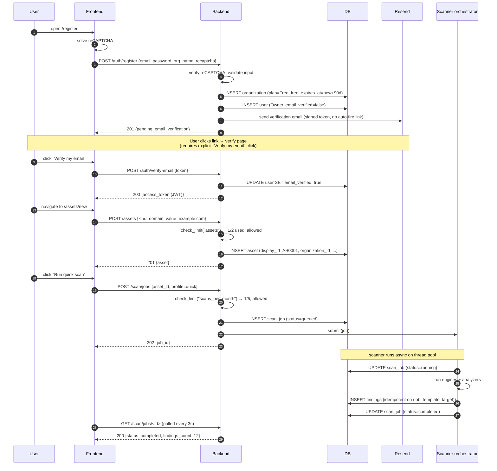
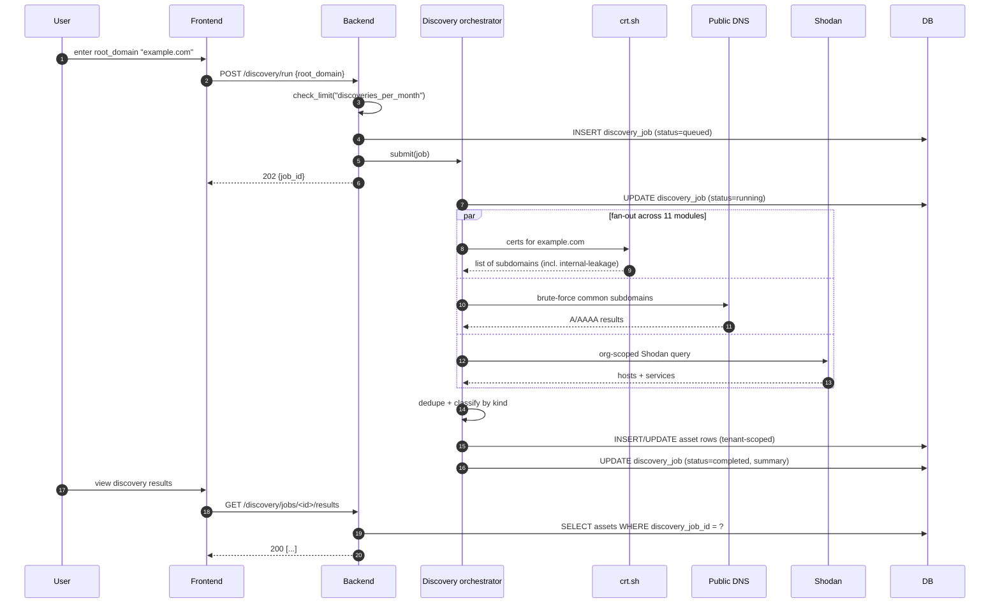
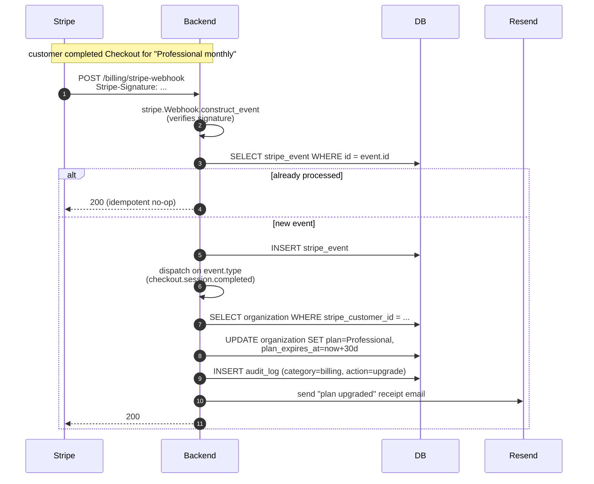
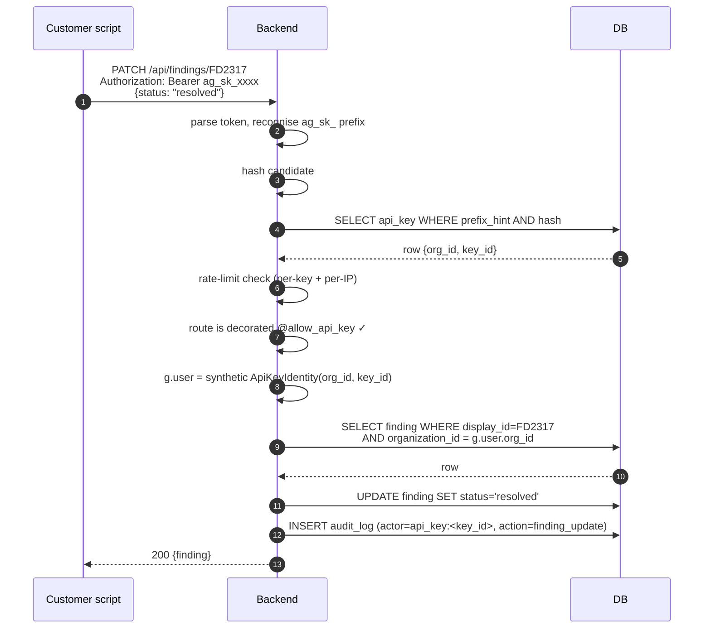
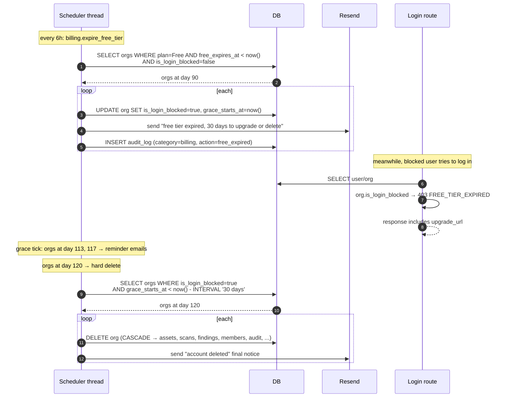
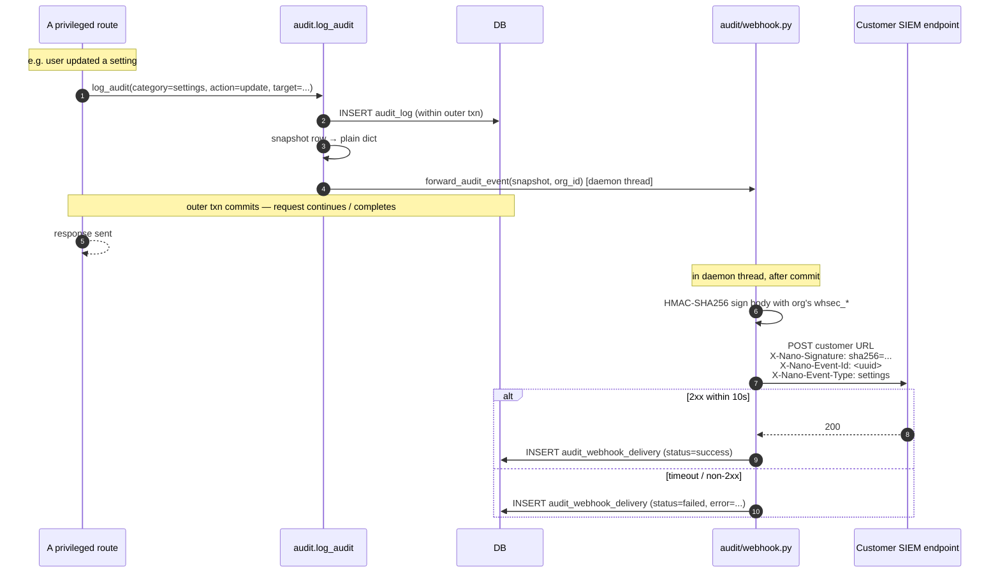
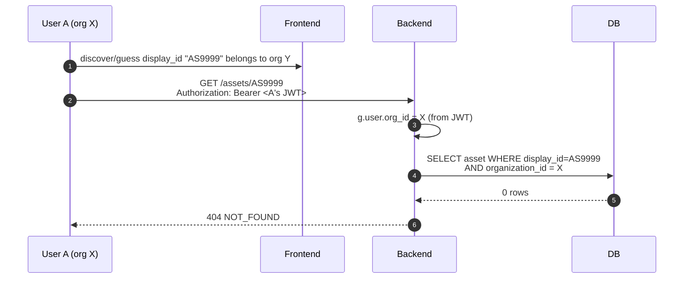
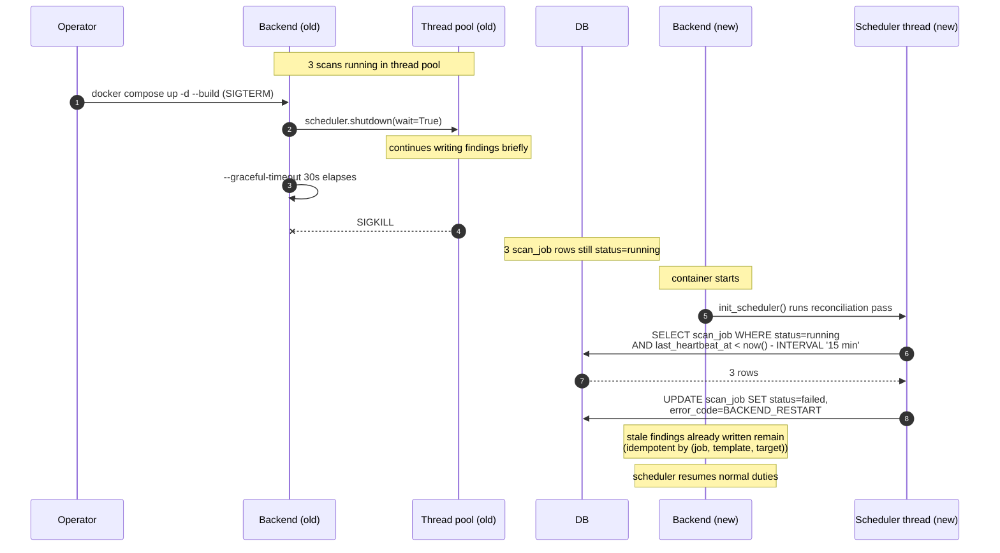
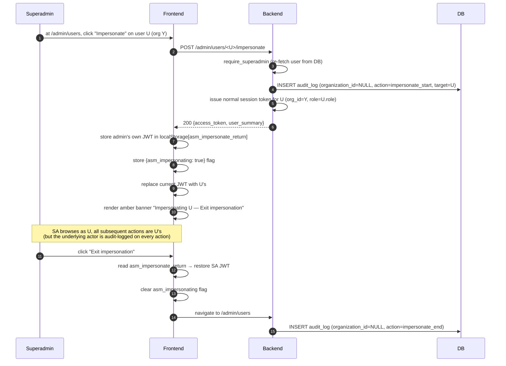

# SAD View 09 — Key Scenarios

| Field | Value |
|---|---|
| Parent document | `03-sad.md` |
| View ID | 09 — Scenarios (the "+1" of 4+1) |
| Status | Draft |
| Last reviewed | 2026-05-05 |

This view illustrates the most architecturally significant flows end-to-end, tying the four other views together. Each scenario shows the pieces in motion: which components are involved, where the data lives, and where the system enforces invariants. The choices below are the flows where multiple SRS modules interact and where most of the architecture earns its keep.

Scenarios in this view:

1. New user signup → first scan
2. Discovery → asset onboarding
3. Scheduled monitoring tick
4. Stripe webhook → plan upgrade
5. API key authentication → finding update
6. Free-tier expiry → 30-day grace → hard delete
7. Audit log → customer SIEM webhook
8. Cross-tenant isolation guard (illustrative)
9. Backend container restart with in-flight scans
10. Superadmin impersonation

---

## 1. New user signup → first scan

**SRS modules touched:** 01 (Onboarding), 02 (Auth), 03 (Org), 05 (Assets), 07 (Scanning), 10 (Billing)



**Architectural points illustrated:**
- Email verification gate (§06 Security §4) sits between signup and login.
- Plan limits (§05 Data §3, §06 Security §7) check **before** any expensive operation.
- Scan kickoff is **async** (§02 Runtime §5) — request returns 202 immediately.
- Display ids (`AS0001`, `SC0001`) become the user-facing identifier from this point on (§05 Data §5).
- The 90-day Free expiry (§05 Data §8 retention; SRS FR-BILL-002) is set at org creation; nothing else needs to track it.

---

## 2. Discovery → asset onboarding

**SRS modules touched:** 05 (Assets), 06 (Discovery)



**Architectural points illustrated:**
- Fan-out concurrency happens **inside the orchestrator's thread**, not via a queue (§02 Runtime §3, §05 Data §9.1).
- Each external source (§07 Integrations §6) can fail independently; the orchestrator merges what came back.
- Discovery is **additive** (§05 Data §9.1) — it never deletes user-owned assets.
- Tenant scoping applies to the writes; an org's discovery cannot touch another org's data even if the root domain string overlaps.

---

## 3. Scheduled monitoring tick

**SRS modules touched:** 09 (Monitoring), 07 (Scanning)

```mermaid
sequenceDiagram
    autonumber
    participant SCH as Scheduler thread
    participant DB
    participant TP as Thread pool
    participant SC as Scanner orchestrator

    Note over SCH: tick every 5 min
    SCH->>SCH: pg_try_advisory_lock(monitor_tick_lock)
    SCH->>DB: SELECT monitors WHERE next_run_at <= now() AND is_active
    DB-->>SCH: due monitors

    loop each due monitor
        SCH->>DB: pg_try_advisory_lock(monitor_id)
        alt got lock
            SCH->>DB: INSERT scan_job (source=monitor, status=queued)
            SCH->>TP: submit(run_scan, job_id)
            SCH->>DB: UPDATE monitor SET next_run_at = now() + cadence
            SCH->>DB: pg_advisory_unlock(monitor_id)
        else previous tick still running
            SCH->>SCH: skip (logged WARN)
        end
    end

    Note over TP,SC: scans run async; same path as user-triggered scans
    TP->>SC: run scan
    SC->>DB: write findings, update job
```

**Architectural points illustrated:**
- One scheduler-owning worker only (§02 Runtime §3); file-lock election.
- **Per-row advisory lock** prevents overlapping runs of the same monitor — the scheduler can drift by a tick, but a slow monitor is never doubled-up (§02 Runtime §6).
- Monitor scans share the same `scan_job` table and same scanner orchestrator as user-triggered scans. Plan limits count both against `scans_per_month` (CLAUDE.md hard rule #4).
- **Indexed on `(next_run_at)` partial WHERE `is_active`** (§05 Data §10) — the scheduler's hot path is cheap.

---

## 4. Stripe webhook → plan upgrade

**SRS modules touched:** 10 (Billing)



**Architectural points illustrated:**
- Signature verification is **non-negotiable** before parsing the body (§06 Security §10, §07 Integrations §2.3).
- Idempotency is a **table** (`stripe_event`, §05 Data §8) keyed by Stripe's event id. Stripe retries → no-op.
- Receipt email goes through **Resend** from `nanoasm.com`, not Stripe's default mailer (§07 Integrations §3.5).
- Audit log row is written within the same transaction as the plan change.

---

## 5. API key authentication → finding update

**SRS modules touched:** 04 (Findings), 17 (API Access)



**Architectural points illustrated:**
- API key auth follows the same **tenant-scoping discipline** as JWT auth (§06 Security §6, §05 Data §3).
- The `@allow_api_key` decorator is the **default-deny** opt-in (FR-API-004): try the same call against `/billing/upgrade` and you get 403 `API_KEY_NOT_ALLOWED`.
- Audit log records the **API key id** as actor — when the key is revoked, the operator can correlate any damage (FR-API-014).
- The `display_id` (`FD2317`) is canonical in the URL (FR-API-013).

---

## 6. Free-tier expiry → 30-day grace → hard delete

**SRS modules touched:** 10 (Billing), 11 (Audit), 16 (Data retention)



**Architectural points illustrated:**
- The whole lifecycle (§05 Data §8 retention) is enforced by **one scheduled job**, not threaded through the request path.
- Login-block is a **separate flag** (`is_login_blocked`) from suspension; the user gets a distinct error message and an upgrade path.
- Hard delete is a **DB cascade** — every tenant-scoped table has its FK to `organization` set up so a single `DELETE` removes the lineage in one transaction (§05 Data §11 expand-contract discipline applies).
- An upgrade during grace flips the flag back, restoring access; nothing has been deleted yet.

---

## 7. Audit log → customer SIEM webhook

**SRS modules touched:** 11 (Audit), 12 (Integrations)



**Architectural points illustrated:**
- Audit row is committed **before** webhook fires (§05 Data §9.3) — the snapshot is plain dict because SQLAlchemy instances cannot cross thread boundaries and the row's transaction isn't visible to a background session.
- Webhook is **fire-and-forget**: a customer SIEM going down does not roll back the user's settings change.
- Per-event UUID enables idempotency on the receiver (§07 Integrations §8.1).
- Plan-gated to Enterprise Gold + Custom; non-eligible orgs simply have no forwarder configured (silent no-op).

---

## 8. Cross-tenant isolation guard (illustrative)

**SRS modules touched:** all (this is a property, not a feature)

The most security-critical scenario is the one we *don't* want to happen — user A reading user B's data. The architecture guards this with three layers (§06 Security §8). An illustrative attempted attack:



**Architectural points illustrated:**
- Tenant scoping is in the **query**, not the serializer (§05 Data §3.2). The DB never returns the row.
- The error is **404, not 403** — we don't reveal "this id exists but you can't see it."
- Even if Display ids are guessable (they are; they're monotonic per-tenant), the guess is harmless because the cross-tenant lookup returns nothing.
- The same pattern protects scan jobs, findings, members, monitors, reports, audit log entries, and every other tenant-scoped resource.

---

## 9. Backend container restart with in-flight scans

**SRS modules touched:** 07 (Scanning), 16 (Reliability NFRs)



**Architectural points illustrated:**
- Graceful shutdown gets 30 seconds (§02 Runtime §9). Scans that finish within that window land cleanly; longer ones are killed.
- Reconciliation pass on boot (§02 Runtime §10) is the only recovery — we don't auto-resume.
- Findings already written are kept; idempotent insert key prevents double-count on a manual rerun.
- The user sees the failed job in the UI and may rerun manually.

This is also the scenario that motivates the future **decouple long-running scans onto worker hosts** scaling step (§04 Deployment §10 step 5) — at that point the worker host outliving the API host stops being a workaround.

---

## 10. Superadmin impersonation

**SRS modules touched:** 11 (Audit), platform-admin (CLAUDE.md)



**Architectural points illustrated:**
- `require_superadmin` re-fetches user from DB **every request** (§06 Security §15) — JWT-only trust is insufficient, a revoked superadmin loses access on the next click.
- Impersonate **issues a normal session** for the target user; the system itself can't tell the difference downstream. This means tenant-scoping continues to work without special cases.
- Audit log captures both ends (`impersonate_start` / `impersonate_end`) with `organization_id=NULL` (platform-level action) and the target user as the audit target. Subsequent actions during impersonation are audit-logged as the target user, with metadata noting the impersonator.
- Superadmin cannot impersonate another superadmin (privilege escalation guard).

---

## 11. What scenarios view does not show

- The static module structure → §01-logical-view
- The runtime process model that powers the sequences → §02-runtime-view
- Code organisation supporting these flows → §03-development-view
- Deployment topology these flows run on → §04-deployment-view
- Schemas of the tables these flows touch → §05-data-architecture
- Auth and tenant-scoping primitives → §06-security-architecture
- Vendor-specific contracts → §07-external-integrations
- How we observe these flows in production → §08-observability

---

*End of view 09 — Key scenarios.*
