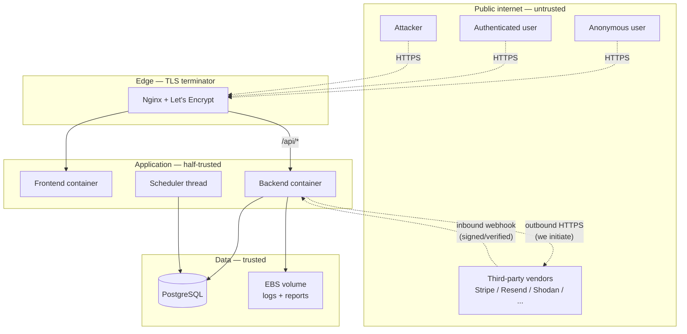

# 04 — Threat Model

| Field | Value |
|---|---|
| Document | 04 — Threat Model |
| Owner | Founder / sole engineer |
| Status | Draft |
| Methodology | STRIDE per component, with data-flow diagrams |
| Last reviewed | 2026-05-05 |
| Review cadence | Quarterly + on any architectural change touching auth, tenancy, or external trust boundaries |
| Related docs | `02-srs.md`, `03-sad.md`, `05-security-policy.md` (forthcoming), `06-test-strategy.md` (forthcoming) |

---

## 1. Purpose and scope

The threat model identifies what an attacker (external or internal) might attempt against Nano EASM, what we are doing about it, and where the residual risk sits. It is the **security counterpart** to the SAD and the **input to** the security test strategy.

Nano EASM is a security product, which means:
- The blast radius of a compromise is greater than for a generic SaaS — customer's attack surface data, scan results, finding evidence, and credentials for integration endpoints all live in our database.
- The customer trust assumption is sharper — "you sell us security, we expect you to **be** secure."
- Our threat model is read by customer security teams as part of vendor-risk review.

### 1.1 In scope

- The Nano EASM platform: web app, REST API, scheduler, all containers on the EC2 host.
- The data we persist: tenant data, audit logs, billing state, integration configurations.
- External integrations we initiate: Stripe, Resend, Shodan, VirusTotal, AbuseIPDB, crt.sh, public DNS, reCAPTCHA.
- Customer-controlled outbound integrations: audit webhook, Slack webhook, Jira.
- Public surfaces: landing page, login, registration, public quick-scan, public lookup tools.
- Platform admin console (`/admin/*`) and superadmin model.

### 1.2 Out of scope

- Threats against customer infrastructure or the assets being scanned. (Customers' attack surface is **their** problem; we report on it, we do not defend it.)
- The integrity of third-party services we depend on — we treat Stripe, Resend, Shodan as semi-trusted partners with their own security posture.
- Threats against AWS as an infrastructure provider — we trust AWS within its shared-responsibility model; we own the application and configuration above the host.
- Physical security of AWS data centres.
- Social engineering against the founder / sole engineer that does not have a technical control point in the platform itself (covered in 05 Security Policy).

### 1.3 Methodology

We use **STRIDE** (Spoofing, Tampering, Repudiation, Information disclosure, Denial of service, Elevation of privilege) **applied per major component / data flow**. Each threat is rated on:

- **Likelihood** — Low / Medium / High.
- **Impact** — Low / Medium / High.
- **Risk** — function of the two; flagged High when both are Medium-or-above.

We do not pretend to score this with a CVSS-style number. The team is small enough that prose-level prioritisation is honest; precision would be theatrical.

---

## 2. Assets, actors, trust boundaries

### 2.1 Assets we protect

| Tier | Asset | Why it matters |
|---|---|---|
| **Crown jewels** | User credentials (password hashes, MFA secrets) | Reused across systems by users; compromise harms them beyond Nano EASM |
| **Crown jewels** | Customer scan results, finding evidence | Maps customer's attack surface in detail; useful to a real attacker against them |
| **Crown jewels** | API keys (`ag_sk_*`) | Programmatic access to customer's tenant; revocable but valuable |
| **Crown jewels** | Customer integration secrets (Slack URL, Jira API token, audit-webhook secret) | Lateral movement into customer's other systems |
| **High** | Audit logs | Tampering destroys forensics; loss harms customer's compliance evidence |
| **High** | Stripe customer ids and subscription state | Billing fraud potential; revenue impact |
| **High** | Superadmin authority | Cross-tenant impersonation, data deletion, broadcast |
| **Medium** | Asset inventory and discovery results | Useful reconnaissance against the customer |
| **Medium** | User PII (name, email, login IP) | Privacy impact, regulatory exposure |
| **Low** | Public marketing content | Defacement is reputational |

### 2.2 Threat actors

| Actor | Motivation | Sophistication | Likelihood of targeting us |
|---|---|---|---|
| **Opportunistic scanner / botnet** | Crypto, ransomware, credential stuffing | Low–Medium | Constant background |
| **Targeted attacker (criminal)** | Resell scan data; credential theft → other systems | Medium–High | Low at our size, rises with customer prominence |
| **Targeted attacker (nation-state)** | Identifying soft targets in customer attack surface | Very high | Very low at our size; non-zero if a customer becomes high-value |
| **Disgruntled customer / former customer** | Damage retaliation, data exfil | Medium | Low–Medium |
| **Disgruntled employee / contractor** | Insider threat | Variable | Single-engineer team — no separate insider threat surface today; expands as we hire |
| **Curious customer** | Probing tenant boundaries, finding bugs | Medium | Constant — security pros are our user base |
| **Compliance / pen-test contracted on customer's behalf** | Customer's auditor running tests against their tenant | Medium | Periodic — we should distinguish from an attacker |
| **Spam / abuse actor** | Free-tier abuse, public-quick-scan abuse | Low | Constant background |

### 2.3 Trust boundaries

The boundaries:
- **Public internet → Nginx**: all anonymous traffic, all authenticated traffic, all attacker traffic. TLS terminates here. Only ports 80/443 open inbound.
- **Nginx → app containers**: same-host bridge. Plaintext, accepted because of single-host.
- **App → DB**: same-host bridge. Plaintext. DB is not exposed beyond the bridge.
- **App → external vendors**: outbound HTTPS, authenticated by API keys we hold.
- **Vendor → app (webhook)**: inbound from Stripe specifically; signature-verified.

The **most porous** boundary is "authenticated user vs attacker" — both arrive through the same Nginx front door. The system relies on auth checks at the application layer to distinguish them.

---

## 3. STRIDE per component

The following sections walk through each major component and ask the STRIDE questions. Threats are tagged `T-NN` for cross-reference; mitigations are tagged `M-NN`. The risk column folds likelihood × impact into a single High / Medium / Low judgement.

---

### 3.1 Public web surface (landing, login, register, quick-scan)

**Assets:** brand, public tools, registration funnel, anonymous-rate-limited compute (quick-scan).

| ID | Threat | STRIDE | Likelihood | Impact | Risk | Mitigation |
|---|---|---|---|---|---|---|
| T-01 | Credential stuffing on `/auth/login` | S | High | Medium | **High** | M-01: Per-IP + per-email rate limiting (Flask-Limiter). M-02: Email verification required before first login. M-03 (gap): account lockout / progressive delay. M-04 (planned): MFA optional today, mandatory for elevated roles. |
| T-02 | Bot signup floods to exhaust Free tier | D | High | Low | Medium | M-05: reCAPTCHA v3 on register. M-06: Email verification gate. M-07: Free tier 90-day expiry + login-block. |
| T-03 | Quick-scan abuse (anonymous compute consumption) | D | High | Low | Medium | M-08: 5 scans / hour / IP rate limit (counted in `quick_scan_log`). M-09: IP block list managed by superadmin. M-10: reCAPTCHA on the public quick-scan form. |
| T-04 | Phishing site mimicking `nanoeasm.com` to harvest credentials | S | Medium | High | **High** | M-11: HSTS + DNS CAA record limits which CAs can issue for our domain. M-12 (out-of-platform): user education in onboarding email. M-13 (planned): MFA reduces value of harvested passwords. |
| T-05 | Stored XSS via user-supplied content on a public page | T,I | Low | High | Medium | M-14: React escapes by default. M-15: CSP locks down inline script and frame-ancestors. M-16: No `dangerouslySetInnerHTML` on user data. M-17: Content shown on public pages is admin-controlled (announcements, tools), not user-submitted. |
| T-06 | Subdomain takeover (orphaned DNS pointing to deprovisioned 3rd-party) | S,T | Low | Medium | Low | M-18: Inventory of DNS records (we are an EASM company; we eat our own dog food on this). M-19: Quarterly DNS audit against actual asset inventory. |
| T-07 | Cert mis-issuance / Let's Encrypt outage | S,D | Low | High | Medium | M-20: CAA record. M-21: certbot auto-renew with 30-day buffer. M-22: monitoring hits `/health` over HTTPS — cert expiry would fail it. |

---

### 3.2 Authenticated web app

**Assets:** all customer data, all settings, all per-tenant operations.

| ID | Threat | STRIDE | Likelihood | Impact | Risk | Mitigation |
|---|---|---|---|---|---|---|
| T-08 | JWT theft via XSS | S,I,E | Low | **High** | **High** | M-23: React escaping + CSP (T-05 mitigations). M-24: Short JWT lifetime (30 min absolute, sliding inactivity). M-25 (planned): Per-`jti` denylist for explicit revocation. M-26 (planned): MFA shrinks impact for elevated roles. |
| T-09 | JWT theft via shared / compromised browser | S | Medium | Medium | Medium | M-24 above. M-27: Logout clears localStorage + invalidates client state. M-28: Sliding inactivity gate signs idle users out automatically. |
| T-10 | Password reset / verification token consumed by email scanner before user click | T,D | High | Low–Medium | Medium | M-29: Verification / reset / MFA-enrol landing pages **never** auto-fire on mount; explicit user click required. (Regression fix; uniformly applied.) |
| T-11 | CSRF leveraging logged-in browser | T | Very low | – | Low | M-30: JWT in `Authorization` header, not cookie. No auto-attached credential — CSRF is structurally not present. |
| T-12 | Cross-tenant data leak (horizontal escalation) | I,E | Medium | **Critical** | **High** | M-31: Tenant scoping in every query (`organization_id = g.user.org_id`). M-32: Redundant `organization_id` on child tables (single-filter scoping). M-33: Cross-tenant tests for every tenant-scoped route. M-34: Cross-tenant lookups return 404, not 403 (no oracle). M-35 (planned): Postgres RLS as defence-in-depth. |
| T-13 | Vertical privilege escalation (Viewer→Admin) | E | Low | High | Medium | M-36: `@require_role(...)` decorator on every privileged route. M-37: Test suite covers each route with each role. M-38: Role is in JWT claim; tampering breaks signature. |
| T-14 | Plan-limit bypass | T | Low | Low | Low | M-39: `@check_limit("scans_per_month")` etc. enforce server-side, not client. M-40: Limits live in `app/auth/permissions.py` and are uniformly applied. |
| T-15 | Account takeover via password-reset flow weakness | S | Low | High | Medium | M-41: Reset token is HMAC-signed with separate secret, single-use, 1-hour expiry. M-42: Email link does not auto-fire. M-43: Reset event audit-logged. |
| T-16 | Stored XSS via user-controlled fields surfaced to other tenant members | I,T | Low | High | Medium | M-44: All user-submitted strings escaped on render (React default). M-45: No HTML rendering of customer data anywhere. M-46: CSP blocks inline scripts. |
| T-17 | Open redirect on `/auth/login?next=...` | S | Low | Medium | Low | M-47: Allowlist of internal paths only — any value not starting with `/` is rejected. |

---

### 3.3 REST API (programmatic — API keys)

**Assets:** programmatic access to tenant data; same surface as authenticated web app, but with default-deny scopes.

| ID | Threat | STRIDE | Likelihood | Impact | Risk | Mitigation |
|---|---|---|---|---|---|---|
| T-18 | API key theft via accidental publication (GitHub repo, support ticket, log) | S,I | Medium | High | **High** | M-48: Plaintext shown once at creation; storage hashed. M-49: Prefix `ag_sk_` is a recognisable token shape; downstream secret-scanners flag it. M-50: Customer-side guidance to revoke + rotate. M-51: Per-key audit-log correlation lets the customer assess damage. |
| T-19 | API key brute-force | S | Low | High | Medium | M-52: Per-IP and per-route rate limits. M-53: Revoked key returns 401 immediately (no oracle). M-54: 32+ random bytes of entropy. M-55 (gap): per-key brute-force counter with exponential lockout. |
| T-20 | API key used to call non-opted-in routes (e.g. billing, settings, admin) | E | Low | High | Medium | M-56: **Default-deny** decorator model — `@allow_api_key` is opt-in. M-57: Routes that mutate billing / member / settings / admin **never** opt in. M-58: API key call to non-opted route returns 403 `API_KEY_NOT_ALLOWED`. |
| T-21 | Rate-limit bypass on API key | T,D | Medium | Medium | Medium | M-59: Per-route Flask-Limiter defaults today. M-60 (PARTIAL — flagged in SRS FR-API-005): explicit per-key counters before public API GA. |
| T-22 | Idempotency double-submit on write endpoints | T | Low | Low | Low | M-61 (gap, FR-API-012): Idempotency-Key header acceptance not yet implemented. Today, customer-side discipline. |

---

### 3.4 Scheduler thread + scan / discovery executor

**Assets:** scheduled monitoring, scan execution, discovery, scheduled billing actions (trial expiry, free expiry).

| ID | Threat | STRIDE | Likelihood | Impact | Risk | Mitigation |
|---|---|---|---|---|---|---|
| T-23 | Scheduler tick double-firing across workers | T | Low | Low | Low | M-62: File-lock election for scheduler ownership. M-63: Per-row `pg_try_advisory_lock` per monitor / schedule prevents overlap. M-64: Idempotent operations (monitor-advance, finding-insert) absorb duplicate ticks. |
| T-24 | Scheduler crash → expiry / cleanup jobs stop running | D,T | Low | High | Medium | M-65: Failure-isolated jobs (each in `try / except`). M-66: Watchdog via `/admin/health` page surfaces stale tick freshness. M-67 (planned): external alerting on scheduler tick lag. |
| T-25 | Customer-supplied scan template (future feature) executes server-side code | E | n/a today | High | n/a | We do not currently accept customer-supplied templates. If we ever do (planned, post-launch), threat raises to **High** — would require process / container isolation. |
| T-26 | Scanner hits a target the customer doesn't own (mis-attribution / typo at registration) | T,D | Medium | Medium | Medium | M-68: Domain-ownership verification at root-domain add (DNS TXT challenge, planned). M-69: Public quick-scan is rate-limited and IP-blockable. M-70: ToS makes customer responsible for authorisation to scan. |
| T-27 | Backend restart during in-flight scan corrupts state | T | Medium | Low | Low | M-71: Reconciliation pass on boot (`status=running` + `last_heartbeat_at` stale → `failed`). M-72: Findings idempotent on `(job, template, target)`. |

---

### 3.5 PostgreSQL data layer

**Assets:** every customer's data; the platform's authority.

| ID | Threat | STRIDE | Likelihood | Impact | Risk | Mitigation |
|---|---|---|---|---|---|---|
| T-28 | SQL injection | T,I | Low | **Critical** | Medium | M-73: SQLAlchemy parametrised queries everywhere. M-74: Raw SQL appears in two places (migrations, one analytics query) — bound parameters, code-reviewed. M-75: No string-concatenated SQL anywhere user input is in scope. |
| T-29 | Backup file leak | I | Low | Critical | Medium | M-76: Backups stored on the EBS volume (encrypted at rest by AWS default for gp3). M-77: Off-host backup (planned) will be S3 with bucket policy + SSE-KMS. M-78 (gap): app-layer encryption of crown-jewel columns flagged in §05 Data §12. |
| T-30 | Database direct access via leaked credentials | E | Low | **Critical** | Medium | M-79: DB password in `.env` on the host, mode 600. M-80: DB port not exposed beyond Docker bridge. M-81 (planned): Secrets Manager + IAM-issued ephemeral DB creds when we move to RDS. |
| T-31 | Audit log tampering / deletion | T,R | Low | High | Medium | M-82: Append-only convention (no edit / delete endpoints other than retention purge). M-83: Retention purge is a single dated job, audit-logged itself. M-84 (planned): immutable audit shipping to customer SIEM via webhook gives the customer an out-of-band copy. |
| T-32 | Long-running query starvation across tenants (noisy neighbour) | D | Medium | Low | Low | M-85: Pagination on every list endpoint; max page size 200. M-86: Statement timeout (planned — currently default). M-87: Query review during code review. |

---

### 3.6 External integrations (outbound)

**Assets:** integration secrets; the integrity of integration data; downstream customer systems.

| ID | Threat | STRIDE | Likelihood | Impact | Risk | Mitigation |
|---|---|---|---|---|---|---|
| T-33 | Stripe webhook spoofing | S,T | Low | High | Medium | M-88: Signature verification with `STRIPE_WEBHOOK_SECRET`. M-89: Per-event idempotency table. M-90: Body of unverified webhook not logged. |
| T-34 | Customer audit-webhook URL set to internal AWS metadata endpoint (SSRF) | I | Low | Medium | Low (today) | M-91: Single-host topology has no internal-only services to leak. M-92 (planned, mandatory at private-network step): SSRF deny-list (RFC1918, link-local, AWS metadata). |
| T-35 | Vendor API key leak from server (Shodan, Resend, Stripe secret) | I,E | Low | High | Medium | M-93: Keys in `.env` on host, mode 600. M-94: Keys never logged. M-95 (planned): Secrets Manager. M-96: Quarterly key rotation for vendor keys; rotation-on-compromise as standard. |
| T-36 | Customer Slack / Jira webhook URL leak through our DB → 3rd-party access to customer's tools | I | Low | Medium | Medium | M-97: Stored hashed (Slack URL) / encrypted (Jira token, planned — currently hashed). M-98: Customer-controlled — they revoke server-side. M-99: Audit-logged whenever notification fires. |
| T-37 | Vendor compromise (Stripe / Resend / Shodan) | S,T | Very low | High | Low | M-100: We trust them within their published security posture; we monitor their incident pages. M-101: Webhooks signature-verified; we don't blindly trust requests from them. |
| T-38 | Egress to malicious URL (e.g. customer-supplied audit webhook to attacker-controlled host) | I | Medium | Low | Low | M-102: Customer-controlled, customer-owned blast radius. M-103: We do not auto-replay requests; failures recorded only. |

---

### 3.7 Platform admin console

**Assets:** cross-tenant authority. The single most powerful surface.

| ID | Threat | STRIDE | Likelihood | Impact | Risk | Mitigation |
|---|---|---|---|---|---|---|
| T-39 | Superadmin credential compromise | S,E | Low | **Critical** | **High** | M-104: Superadmin granted only via Flask CLI (`flask grant-superadmin`) on the host — no UI grant path. M-105 (planned, mandatory): MFA required for `is_superadmin` accounts. M-106: All admin actions audit-logged with `organization_id=NULL`. M-107: `/admin/*` returns 404 to non-superadmins (no oracle). |
| T-40 | Insider abuse — superadmin browses tenant data without justification | I,R | Low (single engineer, will rise) | High | Medium | M-108: Audit log captures every admin read of tenant data. M-109: Customer-facing surface (planned): "your tenant was viewed by a Nano EASM operator at $time" notification for tenant-data reads beyond support cases. M-110 (planned, post-hire): two-person review for destructive admin actions. |
| T-41 | Privileged action without re-auth (stale superadmin JWT after CLI revoke) | E | Low | High | Medium | M-111: `require_superadmin` re-fetches user from DB on every request — JWT-only trust insufficient. M-112: CLI revoke takes effect at next request. |
| T-42 | Impersonation abuse | E,R | Low | High | Medium | M-113: Impersonation issues a normal session for the target; downstream tenant scoping continues to apply. M-114: `impersonate_start` / `impersonate_end` audit-logged with both actor and target. M-115: Impersonator banner visible to admin throughout session. M-116: Superadmin cannot impersonate another superadmin (privilege flat). |

---

### 3.8 Build / deploy / supply chain

**Assets:** ability to ship arbitrary code into production.

| ID | Threat | STRIDE | Likelihood | Impact | Risk | Mitigation |
|---|---|---|---|---|---|---|
| T-43 | Compromised npm / pip dependency | T | Medium | **Critical** | **High** | M-117: Pinned versions in `requirements.txt` and `package-lock.json`. M-118: Quarterly dependency upgrade window; tests are the regression check. M-119: Pre-commit / CI lint catches obvious issues. M-120 (planned): Dependabot + supply-chain advisory subscription. M-121: No auto-merge of dependency PRs. |
| T-44 | Compromised CI runner (GitHub Actions) | T,E | Low | Critical | Medium | M-122: CI does not push images today (production builds on-host). M-123: CI cannot deploy — it has no production credentials. M-124 (when adopted): OIDC-federated AWS auth, scoped roles. |
| T-45 | Compromised developer laptop | T,E | Low | Critical | Medium | M-125: SSH key required for production access; key on FDE-encrypted laptop. M-126: No production secrets in repo. M-127: AWS account 2FA. M-128 (single-engineer): when team grows, separation-of-duties for production access. |
| T-46 | Branch-protection bypass / force-push to master | T | Very low | High | Low | M-129: GitHub branch protection on `master`: requires PR, requires CI green, no force-push. M-130: Repo is private since creation. |
| T-47 | Sensitive value committed to git history | I | Medium | High | Medium | M-131: `.gitignore` covers `.env`, `*.pem`, `secrets.*`. M-132: Pre-commit hook for `BoltEdge` and similar patterns; can be extended to common secret patterns. M-133 (planned): `git-secrets` / `gitleaks` in CI. |

---

### 3.9 Operations / runtime / availability

**Assets:** uptime, latency, observability.

| ID | Threat | STRIDE | Likelihood | Impact | Risk | Mitigation |
|---|---|---|---|---|---|---|
| T-48 | DDoS at Nginx | D | Medium | High | Medium | M-134: Per-IP rate limits at the application layer. M-135 (planned at scale): CloudFront / Cloudflare in front of Nginx. M-136: EC2 instance type can absorb modest floods; scaling step is vertical-first. |
| T-49 | Connection-pool exhaustion via slow query | D | Low | Medium | Low | M-137: Statement timeout (planned). M-138: Connection-pool stats visible on `/admin/health`. M-139: Pagination + scoped queries minimise expensive plans. |
| T-50 | EBS volume failure / full disk | D | Low | Critical | Medium | M-140: CloudWatch disk alarm (host-level). M-141: Log rotation. M-142: Backup verification (planned — restore tested quarterly). |
| T-51 | Container OOM killer | D | Low | Medium | Low | M-143: Default container memory limits not set today; t2.medium has 4 GB shared. M-144 (planned at scaling step): per-container memory limits + alerts. |
| T-52 | Single-AZ outage | D | Low | High | Medium | M-145: Single-AZ today; full outage during AZ event. M-146: Backup snapshot restore in another AZ ~1 hour. M-147 (planned): multi-AZ when revenue justifies. |

---

## 4. Risk register summary

The threats rated **High** risk and our posture on each:

| ID | Threat | Posture |
|---|---|---|
| T-01 | Credential stuffing | Mostly mitigated; **MFA gap is the only material remaining work**. Tracked in pivot tasks §10.1. |
| T-04 | Phishing site mimicking us | Mitigated as far as the platform can; user-education and MFA close the residual. |
| T-08 | JWT theft via XSS | Defence-in-depth via CSP, escaping, short token lifetime; **per-user revocation gap** (no `jti` denylist). Tracked in pivot tasks §10.2. |
| T-12 | Cross-tenant data leak | Triple-layer mitigation (query filter + redundant FK + tests). **Postgres RLS would be belt-and-braces** — not in place today. Tracked in pivot tasks §10.2. |
| T-18 | API key theft via accidental publication | Customer-side discipline + our audit correlation. No technical control we can add to prevent customer publishing a key in a public repo, beyond the existing recognisable prefix. |
| T-39 | Superadmin compromise | CLI-only grant + 404-on-non-admin + audit logging. **MFA on superadmin is mandatory and is a gap.** Tracked in pivot tasks §10.1. |
| T-43 | Compromised dependency | Pinning + tests + manual upgrade window. Dependabot would tighten this. |

The **non-residual** classes — CSRF, SQL injection, vertical privilege escalation, plan-limit bypass — are structural; we are not "managing" them, we are "not having them."

---

## 5. Top-priority gaps

In order of risk-reduction value:

1. **MFA implementation** (T-01, T-04, T-08, T-39). 10-task subplan in `00-positioning-pivot-tasks.md` §10.1. Mandatory for superadmin first.
2. **JWT `jti` denylist** (T-08). Adds per-user revocation without rotating the global secret.
3. **Postgres RLS** (T-12). Belt-and-braces tenant isolation; turns "missed `filter_by`" from leak to error.
4. **Account lockout / progressive delay on login** (T-01). Today's rate limit is per-IP; an attacker rotating IPs gets unlimited tries against one email.
5. **Per-API-key brute-force counter** (T-19). Same idea, programmatic surface.
6. **Statement timeout in Postgres** (T-32, T-49). Cheap; bounds the worst-case query plan.
7. **Dependabot + secret-scanning in CI** (T-43, T-47). Detective controls.
8. **External alerting on scheduler / health** (T-24). Today, only a human looking at `/admin/health` notices a stuck tick.

Items 1–3 are the highest-impact. Items 4–8 are good hygiene.

---

## 6. What is structurally absent (and on purpose)

Some classes of vulnerability we have eliminated by design rather than mitigated:

- **CSRF** — no cookie auth (ADR 0005).
- **SQL injection** — parametrised queries throughout (no ORM bypass).
- **Server-side template injection** — Jinja2 used only for email bodies built from server-side strings; never user-driven.
- **XML external entity (XXE)** — no XML parsing of user input.
- **Insecure direct object reference for cross-tenant** — display ids are short, but cross-tenant lookup returns 404 regardless of guess.
- **Padding oracle / classical crypto bugs** — we don't roll our own crypto; bcrypt for passwords, HMAC-SHA256 for HMACs, library defaults for everything else.

---

## 7. What changes the threat model materially

Pivots that warrant a re-review of this document:

| Change | Why it matters |
|---|---|
| Hire a second engineer / contractor | Insider-threat surface expands; access controls and audit trails matter more |
| Add a second backend host | File-lock scheduler election no longer works; secrets sprawl; cross-host trust assumptions |
| Add SSO / OIDC | New auth flow; identity provider becomes a trust dependency |
| Accept customer-supplied scan templates | T-25 activates; isolation requirements tighten dramatically |
| Multi-region deployment | Data residency surface grows; cross-region replication becomes a trust boundary |
| First Enterprise customer with formal security review | Likely produces specific asks (e.g. tenant isolation evidence, encryption-at-rest details) — expect SOC 2 readiness pressure |
| Open-source any component | Supply-chain trust assumptions invert — we'd be the upstream |

---

## 8. References

- `02-srs.md` Module 02 (Authentication), Module 11 (Audit), Module 17 (API Access)
- `03-sad/06-security-architecture.md` — implementation detail for many mitigations
- `03-sad/05-data-architecture.md` §3 — tenant scoping
- `03-sad/09-key-scenarios.md` §8 — cross-tenant attempted attack walkthrough
- `00-positioning-pivot-tasks.md` §10 — gap inventory tracked here
- OWASP Top 10 (2021) — implicit cross-reference; every category considered above
- OWASP ASVS 4.0 — controls referenced via `compliance_map.py` (CLAUDE.md "Compliance Framework Mappings")

---

*End of 04 Threat Model.*
